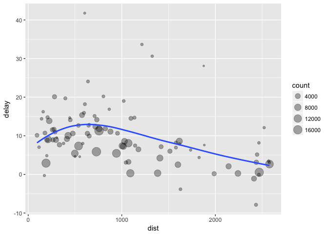

# Homework 3


###Load the Libraries
####nycflights13


####Have a look at the data


```r
?flights
flights<-flights
flights
```

```
## # A tibble: 336,776 × 19
##     year month   day dep_time sched_dep_time dep_delay arr_time
##    <int> <int> <int>    <int>          <int>     <dbl>    <int>
## 1   2013     1     1      517            515         2      830
## 2   2013     1     1      533            529         4      850
## 3   2013     1     1      542            540         2      923
## 4   2013     1     1      544            545        -1     1004
## 5   2013     1     1      554            600        -6      812
## 6   2013     1     1      554            558        -4      740
## 7   2013     1     1      555            600        -5      913
## 8   2013     1     1      557            600        -3      709
## 9   2013     1     1      557            600        -3      838
## 10  2013     1     1      558            600        -2      753
## # ... with 336,766 more rows, and 12 more variables: sched_arr_time <int>,
## #   arr_delay <dbl>, carrier <chr>, flight <int>, tailnum <chr>,
## #   origin <chr>, dest <chr>, air_time <dbl>, distance <dbl>, hour <dbl>,
## #   minute <dbl>, time_hour <dttm>
```

####Filter is by rows
All flights on Jan 1.

```r
filter(flights, month==1, day==1)
```

```
## # A tibble: 842 × 19
##     year month   day dep_time sched_dep_time dep_delay arr_time
##    <int> <int> <int>    <int>          <int>     <dbl>    <int>
## 1   2013     1     1      517            515         2      830
## 2   2013     1     1      533            529         4      850
## 3   2013     1     1      542            540         2      923
## 4   2013     1     1      544            545        -1     1004
## 5   2013     1     1      554            600        -6      812
## 6   2013     1     1      554            558        -4      740
## 7   2013     1     1      555            600        -5      913
## 8   2013     1     1      557            600        -3      709
## 9   2013     1     1      557            600        -3      838
## 10  2013     1     1      558            600        -2      753
## # ... with 832 more rows, and 12 more variables: sched_arr_time <int>,
## #   arr_delay <dbl>, carrier <chr>, flight <int>, tailnum <chr>,
## #   origin <chr>, dest <chr>, air_time <dbl>, distance <dbl>, hour <dbl>,
## #   minute <dbl>, time_hour <dttm>
```

```r
jan1<-filter(flights, month==1, day==1)
```

All flights on Dec 25, to a variable dec25.

```r
(dec25<-filter(flights, month==12, day==25))
```

```
## # A tibble: 719 × 19
##     year month   day dep_time sched_dep_time dep_delay arr_time
##    <int> <int> <int>    <int>          <int>     <dbl>    <int>
## 1   2013    12    25      456            500        -4      649
## 2   2013    12    25      524            515         9      805
## 3   2013    12    25      542            540         2      832
## 4   2013    12    25      546            550        -4     1022
## 5   2013    12    25      556            600        -4      730
## 6   2013    12    25      557            600        -3      743
## 7   2013    12    25      557            600        -3      818
## 8   2013    12    25      559            600        -1      855
## 9   2013    12    25      559            600        -1      849
## 10  2013    12    25      600            600         0      850
## # ... with 709 more rows, and 12 more variables: sched_arr_time <int>,
## #   arr_delay <dbl>, carrier <chr>, flight <int>, tailnum <chr>,
## #   origin <chr>, dest <chr>, air_time <dbl>, distance <dbl>, hour <dbl>,
## #   minute <dbl>, time_hour <dttm>
```

####Logical operators

```r
nov_dec1<-filter(flights, month==11 | month==12)
nov_dec2<-filter(flights, month %in% c(11,12))
```

###Exercises
1. Find all flights that:

a. Had an arrival delay of two or more hours


```r
two_hour_delay1<-filter(flights, (arr_delay >120 | dep_delay > 120))
two_hour_delay2<-filter(flights, arr_delay <= 120, dep_delay <= 120)
```

b. Flew to Houston (IAH or HOU)


```r
two_hour_delay3<-filter(flights, arr_delay > 120)
str(flights)
```

```
## Classes 'tbl_df', 'tbl' and 'data.frame':	336776 obs. of  19 variables:
##  $ year          : int  2013 2013 2013 2013 2013 2013 2013 2013 2013 2013 ...
##  $ month         : int  1 1 1 1 1 1 1 1 1 1 ...
##  $ day           : int  1 1 1 1 1 1 1 1 1 1 ...
##  $ dep_time      : int  517 533 542 544 554 554 555 557 557 558 ...
##  $ sched_dep_time: int  515 529 540 545 600 558 600 600 600 600 ...
##  $ dep_delay     : num  2 4 2 -1 -6 -4 -5 -3 -3 -2 ...
##  $ arr_time      : int  830 850 923 1004 812 740 913 709 838 753 ...
##  $ sched_arr_time: int  819 830 850 1022 837 728 854 723 846 745 ...
##  $ arr_delay     : num  11 20 33 -18 -25 12 19 -14 -8 8 ...
##  $ carrier       : chr  "UA" "UA" "AA" "B6" ...
##  $ flight        : int  1545 1714 1141 725 461 1696 507 5708 79 301 ...
##  $ tailnum       : chr  "N14228" "N24211" "N619AA" "N804JB" ...
##  $ origin        : chr  "EWR" "LGA" "JFK" "JFK" ...
##  $ dest          : chr  "IAH" "IAH" "MIA" "BQN" ...
##  $ air_time      : num  227 227 160 183 116 150 158 53 140 138 ...
##  $ distance      : num  1400 1416 1089 1576 762 ...
##  $ hour          : num  5 5 5 5 6 5 6 6 6 6 ...
##  $ minute        : num  15 29 40 45 0 58 0 0 0 0 ...
##  $ time_hour     : POSIXct, format: "2013-01-01 05:00:00" "2013-01-01 05:00:00" ...
```

```r
houston1<-filter(flights, dest =="IAH" | dest == "HOU")
houston2<-filter(flights, dest %in% c("IAH", "HOU"))
```

c. Were operated by United, American, or Delta


```r
str(flights)
```

```
## Classes 'tbl_df', 'tbl' and 'data.frame':	336776 obs. of  19 variables:
##  $ year          : int  2013 2013 2013 2013 2013 2013 2013 2013 2013 2013 ...
##  $ month         : int  1 1 1 1 1 1 1 1 1 1 ...
##  $ day           : int  1 1 1 1 1 1 1 1 1 1 ...
##  $ dep_time      : int  517 533 542 544 554 554 555 557 557 558 ...
##  $ sched_dep_time: int  515 529 540 545 600 558 600 600 600 600 ...
##  $ dep_delay     : num  2 4 2 -1 -6 -4 -5 -3 -3 -2 ...
##  $ arr_time      : int  830 850 923 1004 812 740 913 709 838 753 ...
##  $ sched_arr_time: int  819 830 850 1022 837 728 854 723 846 745 ...
##  $ arr_delay     : num  11 20 33 -18 -25 12 19 -14 -8 8 ...
##  $ carrier       : chr  "UA" "UA" "AA" "B6" ...
##  $ flight        : int  1545 1714 1141 725 461 1696 507 5708 79 301 ...
##  $ tailnum       : chr  "N14228" "N24211" "N619AA" "N804JB" ...
##  $ origin        : chr  "EWR" "LGA" "JFK" "JFK" ...
##  $ dest          : chr  "IAH" "IAH" "MIA" "BQN" ...
##  $ air_time      : num  227 227 160 183 116 150 158 53 140 138 ...
##  $ distance      : num  1400 1416 1089 1576 762 ...
##  $ hour          : num  5 5 5 5 6 5 6 6 6 6 ...
##  $ minute        : num  15 29 40 45 0 58 0 0 0 0 ...
##  $ time_hour     : POSIXct, format: "2013-01-01 05:00:00" "2013-01-01 05:00:00" ...
```

```r
carriers1<-filter(flights, carrier == "AA" | carrier =="DL" | carrier == "UA")
carriers2<-filter(flights, carrier %in% c("AA", "DL", "UA"))
```

d. Departed in summer (July, August, and September)


```r
filter(flights, between(month, 7, 9))
```

```
## # A tibble: 86,326 × 19
##     year month   day dep_time sched_dep_time dep_delay arr_time
##    <int> <int> <int>    <int>          <int>     <dbl>    <int>
## 1   2013     7     1        1           2029       212      236
## 2   2013     7     1        2           2359         3      344
## 3   2013     7     1       29           2245       104      151
## 4   2013     7     1       43           2130       193      322
## 5   2013     7     1       44           2150       174      300
## 6   2013     7     1       46           2051       235      304
## 7   2013     7     1       48           2001       287      308
## 8   2013     7     1       58           2155       183      335
## 9   2013     7     1      100           2146       194      327
## 10  2013     7     1      100           2245       135      337
## # ... with 86,316 more rows, and 12 more variables: sched_arr_time <int>,
## #   arr_delay <dbl>, carrier <chr>, flight <int>, tailnum <chr>,
## #   origin <chr>, dest <chr>, air_time <dbl>, distance <dbl>, hour <dbl>,
## #   minute <dbl>, time_hour <dttm>
```

e. Arrived more than two hours late, but didn’t leave late


```r
filter(flights, arr_delay > 120, dep_delay <= 0)
```

```
## # A tibble: 29 × 19
##     year month   day dep_time sched_dep_time dep_delay arr_time
##    <int> <int> <int>    <int>          <int>     <dbl>    <int>
## 1   2013     1    27     1419           1420        -1     1754
## 2   2013    10     7     1350           1350         0     1736
## 3   2013    10     7     1357           1359        -2     1858
## 4   2013    10    16      657            700        -3     1258
## 5   2013    11     1      658            700        -2     1329
## 6   2013     3    18     1844           1847        -3       39
## 7   2013     4    17     1635           1640        -5     2049
## 8   2013     4    18      558            600        -2     1149
## 9   2013     4    18      655            700        -5     1213
## 10  2013     5    22     1827           1830        -3     2217
## # ... with 19 more rows, and 12 more variables: sched_arr_time <int>,
## #   arr_delay <dbl>, carrier <chr>, flight <int>, tailnum <chr>,
## #   origin <chr>, dest <chr>, air_time <dbl>, distance <dbl>, hour <dbl>,
## #   minute <dbl>, time_hour <dttm>
```

f. Were delayed by at least an hour, but made up over 30 minutes in flight


```r
filter(flights, dep_delay-arr_delay > 30, dep_delay >= 60)
```

```
## # A tibble: 1,844 × 19
##     year month   day dep_time sched_dep_time dep_delay arr_time
##    <int> <int> <int>    <int>          <int>     <dbl>    <int>
## 1   2013     1     1     2205           1720       285       46
## 2   2013     1     1     2326           2130       116      131
## 3   2013     1     3     1503           1221       162     1803
## 4   2013     1     3     1839           1700        99     2056
## 5   2013     1     3     1850           1745        65     2148
## 6   2013     1     3     1941           1759       102     2246
## 7   2013     1     3     1950           1845        65     2228
## 8   2013     1     3     2015           1915        60     2135
## 9   2013     1     3     2257           2000       177       45
## 10  2013     1     4     1917           1700       137     2135
## # ... with 1,834 more rows, and 12 more variables: sched_arr_time <int>,
## #   arr_delay <dbl>, carrier <chr>, flight <int>, tailnum <chr>,
## #   origin <chr>, dest <chr>, air_time <dbl>, distance <dbl>, hour <dbl>,
## #   minute <dbl>, time_hour <dttm>
```

g. Departed between midnight and 6am (inclusive)


```r
filter(flights, dep_time <=600 | dep_time == 2400)
```

```
## # A tibble: 9,373 × 19
##     year month   day dep_time sched_dep_time dep_delay arr_time
##    <int> <int> <int>    <int>          <int>     <dbl>    <int>
## 1   2013     1     1      517            515         2      830
## 2   2013     1     1      533            529         4      850
## 3   2013     1     1      542            540         2      923
## 4   2013     1     1      544            545        -1     1004
## 5   2013     1     1      554            600        -6      812
## 6   2013     1     1      554            558        -4      740
## 7   2013     1     1      555            600        -5      913
## 8   2013     1     1      557            600        -3      709
## 9   2013     1     1      557            600        -3      838
## 10  2013     1     1      558            600        -2      753
## # ... with 9,363 more rows, and 12 more variables: sched_arr_time <int>,
## #   arr_delay <dbl>, carrier <chr>, flight <int>, tailnum <chr>,
## #   origin <chr>, dest <chr>, air_time <dbl>, distance <dbl>, hour <dbl>,
## #   minute <dbl>, time_hour <dttm>
```

2. Another useful dplyr filtering helper is between(). What does it do? Can you use it to simplify the code needed to answer the previous challenges?

It picks between a range of values.


```r
filter(flights, between(month, 7, 9))
```

```
## # A tibble: 86,326 × 19
##     year month   day dep_time sched_dep_time dep_delay arr_time
##    <int> <int> <int>    <int>          <int>     <dbl>    <int>
## 1   2013     7     1        1           2029       212      236
## 2   2013     7     1        2           2359         3      344
## 3   2013     7     1       29           2245       104      151
## 4   2013     7     1       43           2130       193      322
## 5   2013     7     1       44           2150       174      300
## 6   2013     7     1       46           2051       235      304
## 7   2013     7     1       48           2001       287      308
## 8   2013     7     1       58           2155       183      335
## 9   2013     7     1      100           2146       194      327
## 10  2013     7     1      100           2245       135      337
## # ... with 86,316 more rows, and 12 more variables: sched_arr_time <int>,
## #   arr_delay <dbl>, carrier <chr>, flight <int>, tailnum <chr>,
## #   origin <chr>, dest <chr>, air_time <dbl>, distance <dbl>, hour <dbl>,
## #   minute <dbl>, time_hour <dttm>
```

```r
summary(flights)
```

```
##       year          month             day           dep_time   
##  Min.   :2013   Min.   : 1.000   Min.   : 1.00   Min.   :   1  
##  1st Qu.:2013   1st Qu.: 4.000   1st Qu.: 8.00   1st Qu.: 907  
##  Median :2013   Median : 7.000   Median :16.00   Median :1401  
##  Mean   :2013   Mean   : 6.549   Mean   :15.71   Mean   :1349  
##  3rd Qu.:2013   3rd Qu.:10.000   3rd Qu.:23.00   3rd Qu.:1744  
##  Max.   :2013   Max.   :12.000   Max.   :31.00   Max.   :2400  
##                                                  NA's   :8255  
##  sched_dep_time   dep_delay          arr_time    sched_arr_time
##  Min.   : 106   Min.   : -43.00   Min.   :   1   Min.   :   1  
##  1st Qu.: 906   1st Qu.:  -5.00   1st Qu.:1104   1st Qu.:1124  
##  Median :1359   Median :  -2.00   Median :1535   Median :1556  
##  Mean   :1344   Mean   :  12.64   Mean   :1502   Mean   :1536  
##  3rd Qu.:1729   3rd Qu.:  11.00   3rd Qu.:1940   3rd Qu.:1945  
##  Max.   :2359   Max.   :1301.00   Max.   :2400   Max.   :2359  
##                 NA's   :8255      NA's   :8713                 
##    arr_delay          carrier              flight       tailnum         
##  Min.   : -86.000   Length:336776      Min.   :   1   Length:336776     
##  1st Qu.: -17.000   Class :character   1st Qu.: 553   Class :character  
##  Median :  -5.000   Mode  :character   Median :1496   Mode  :character  
##  Mean   :   6.895                      Mean   :1972                     
##  3rd Qu.:  14.000                      3rd Qu.:3465                     
##  Max.   :1272.000                      Max.   :8500                     
##  NA's   :9430                                                           
##     origin              dest              air_time        distance   
##  Length:336776      Length:336776      Min.   : 20.0   Min.   :  17  
##  Class :character   Class :character   1st Qu.: 82.0   1st Qu.: 502  
##  Mode  :character   Mode  :character   Median :129.0   Median : 872  
##                                        Mean   :150.7   Mean   :1040  
##                                        3rd Qu.:192.0   3rd Qu.:1389  
##                                        Max.   :695.0   Max.   :4983  
##                                        NA's   :9430                  
##       hour           minute        time_hour                  
##  Min.   : 1.00   Min.   : 0.00   Min.   :2013-01-01 05:00:00  
##  1st Qu.: 9.00   1st Qu.: 8.00   1st Qu.:2013-04-04 13:00:00  
##  Median :13.00   Median :29.00   Median :2013-07-03 10:00:00  
##  Mean   :13.18   Mean   :26.23   Mean   :2013-07-03 05:02:36  
##  3rd Qu.:17.00   3rd Qu.:44.00   3rd Qu.:2013-10-01 07:00:00  
##  Max.   :23.00   Max.   :59.00   Max.   :2013-12-31 23:00:00  
## 
```

```r
filter(flights, between(dep_time, 0, 600))
```

```
## # A tibble: 9,344 × 19
##     year month   day dep_time sched_dep_time dep_delay arr_time
##    <int> <int> <int>    <int>          <int>     <dbl>    <int>
## 1   2013     1     1      517            515         2      830
## 2   2013     1     1      533            529         4      850
## 3   2013     1     1      542            540         2      923
## 4   2013     1     1      544            545        -1     1004
## 5   2013     1     1      554            600        -6      812
## 6   2013     1     1      554            558        -4      740
## 7   2013     1     1      555            600        -5      913
## 8   2013     1     1      557            600        -3      709
## 9   2013     1     1      557            600        -3      838
## 10  2013     1     1      558            600        -2      753
## # ... with 9,334 more rows, and 12 more variables: sched_arr_time <int>,
## #   arr_delay <dbl>, carrier <chr>, flight <int>, tailnum <chr>,
## #   origin <chr>, dest <chr>, air_time <dbl>, distance <dbl>, hour <dbl>,
## #   minute <dbl>, time_hour <dttm>
```

3. How many flights have a missing dep_time? What other variables are missing? What might these rows represent?

```r
summary(flights)
```

```
##       year          month             day           dep_time   
##  Min.   :2013   Min.   : 1.000   Min.   : 1.00   Min.   :   1  
##  1st Qu.:2013   1st Qu.: 4.000   1st Qu.: 8.00   1st Qu.: 907  
##  Median :2013   Median : 7.000   Median :16.00   Median :1401  
##  Mean   :2013   Mean   : 6.549   Mean   :15.71   Mean   :1349  
##  3rd Qu.:2013   3rd Qu.:10.000   3rd Qu.:23.00   3rd Qu.:1744  
##  Max.   :2013   Max.   :12.000   Max.   :31.00   Max.   :2400  
##                                                  NA's   :8255  
##  sched_dep_time   dep_delay          arr_time    sched_arr_time
##  Min.   : 106   Min.   : -43.00   Min.   :   1   Min.   :   1  
##  1st Qu.: 906   1st Qu.:  -5.00   1st Qu.:1104   1st Qu.:1124  
##  Median :1359   Median :  -2.00   Median :1535   Median :1556  
##  Mean   :1344   Mean   :  12.64   Mean   :1502   Mean   :1536  
##  3rd Qu.:1729   3rd Qu.:  11.00   3rd Qu.:1940   3rd Qu.:1945  
##  Max.   :2359   Max.   :1301.00   Max.   :2400   Max.   :2359  
##                 NA's   :8255      NA's   :8713                 
##    arr_delay          carrier              flight       tailnum         
##  Min.   : -86.000   Length:336776      Min.   :   1   Length:336776     
##  1st Qu.: -17.000   Class :character   1st Qu.: 553   Class :character  
##  Median :  -5.000   Mode  :character   Median :1496   Mode  :character  
##  Mean   :   6.895                      Mean   :1972                     
##  3rd Qu.:  14.000                      3rd Qu.:3465                     
##  Max.   :1272.000                      Max.   :8500                     
##  NA's   :9430                                                           
##     origin              dest              air_time        distance   
##  Length:336776      Length:336776      Min.   : 20.0   Min.   :  17  
##  Class :character   Class :character   1st Qu.: 82.0   1st Qu.: 502  
##  Mode  :character   Mode  :character   Median :129.0   Median : 872  
##                                        Mean   :150.7   Mean   :1040  
##                                        3rd Qu.:192.0   3rd Qu.:1389  
##                                        Max.   :695.0   Max.   :4983  
##                                        NA's   :9430                  
##       hour           minute        time_hour                  
##  Min.   : 1.00   Min.   : 0.00   Min.   :2013-01-01 05:00:00  
##  1st Qu.: 9.00   1st Qu.: 8.00   1st Qu.:2013-04-04 13:00:00  
##  Median :13.00   Median :29.00   Median :2013-07-03 10:00:00  
##  Mean   :13.18   Mean   :26.23   Mean   :2013-07-03 05:02:36  
##  3rd Qu.:17.00   3rd Qu.:44.00   3rd Qu.:2013-10-01 07:00:00  
##  Max.   :23.00   Max.   :59.00   Max.   :2013-12-31 23:00:00  
## 
```

```r
filter(flights, is.na(dep_time))
```

```
## # A tibble: 8,255 × 19
##     year month   day dep_time sched_dep_time dep_delay arr_time
##    <int> <int> <int>    <int>          <int>     <dbl>    <int>
## 1   2013     1     1       NA           1630        NA       NA
## 2   2013     1     1       NA           1935        NA       NA
## 3   2013     1     1       NA           1500        NA       NA
## 4   2013     1     1       NA            600        NA       NA
## 5   2013     1     2       NA           1540        NA       NA
## 6   2013     1     2       NA           1620        NA       NA
## 7   2013     1     2       NA           1355        NA       NA
## 8   2013     1     2       NA           1420        NA       NA
## 9   2013     1     2       NA           1321        NA       NA
## 10  2013     1     2       NA           1545        NA       NA
## # ... with 8,245 more rows, and 12 more variables: sched_arr_time <int>,
## #   arr_delay <dbl>, carrier <chr>, flight <int>, tailnum <chr>,
## #   origin <chr>, dest <chr>, air_time <dbl>, distance <dbl>, hour <dbl>,
## #   minute <dbl>, time_hour <dttm>
```

I think these are canceled flights.

4. Why is NA ^ 0 not missing? Why is NA | TRUE not missing? Why is FALSE & NA not missing? Can you figure out the general rule? (NA * 0 is a tricky counterexample!)

Need help on this one.

####Arrange rows with arrange()

```r
arrange(flights, year, month, day)
```

```
## # A tibble: 336,776 × 19
##     year month   day dep_time sched_dep_time dep_delay arr_time
##    <int> <int> <int>    <int>          <int>     <dbl>    <int>
## 1   2013     1     1      517            515         2      830
## 2   2013     1     1      533            529         4      850
## 3   2013     1     1      542            540         2      923
## 4   2013     1     1      544            545        -1     1004
## 5   2013     1     1      554            600        -6      812
## 6   2013     1     1      554            558        -4      740
## 7   2013     1     1      555            600        -5      913
## 8   2013     1     1      557            600        -3      709
## 9   2013     1     1      557            600        -3      838
## 10  2013     1     1      558            600        -2      753
## # ... with 336,766 more rows, and 12 more variables: sched_arr_time <int>,
## #   arr_delay <dbl>, carrier <chr>, flight <int>, tailnum <chr>,
## #   origin <chr>, dest <chr>, air_time <dbl>, distance <dbl>, hour <dbl>,
## #   minute <dbl>, time_hour <dttm>
```

```r
arrange(flights, desc(arr_delay))
```

```
## # A tibble: 336,776 × 19
##     year month   day dep_time sched_dep_time dep_delay arr_time
##    <int> <int> <int>    <int>          <int>     <dbl>    <int>
## 1   2013     1     9      641            900      1301     1242
## 2   2013     6    15     1432           1935      1137     1607
## 3   2013     1    10     1121           1635      1126     1239
## 4   2013     9    20     1139           1845      1014     1457
## 5   2013     7    22      845           1600      1005     1044
## 6   2013     4    10     1100           1900       960     1342
## 7   2013     3    17     2321            810       911      135
## 8   2013     7    22     2257            759       898      121
## 9   2013    12     5      756           1700       896     1058
## 10  2013     5     3     1133           2055       878     1250
## # ... with 336,766 more rows, and 12 more variables: sched_arr_time <int>,
## #   arr_delay <dbl>, carrier <chr>, flight <int>, tailnum <chr>,
## #   origin <chr>, dest <chr>, air_time <dbl>, distance <dbl>, hour <dbl>,
## #   minute <dbl>, time_hour <dttm>
```

####Exercises

1. How could you use arrange() to sort all missing values to the start? (Hint: use is.na()).

```r
arrange(flights, desc(is.na(dep_time)), dep_time)
```

```
## # A tibble: 336,776 × 19
##     year month   day dep_time sched_dep_time dep_delay arr_time
##    <int> <int> <int>    <int>          <int>     <dbl>    <int>
## 1   2013     1     1       NA           1630        NA       NA
## 2   2013     1     1       NA           1935        NA       NA
## 3   2013     1     1       NA           1500        NA       NA
## 4   2013     1     1       NA            600        NA       NA
## 5   2013     1     2       NA           1540        NA       NA
## 6   2013     1     2       NA           1620        NA       NA
## 7   2013     1     2       NA           1355        NA       NA
## 8   2013     1     2       NA           1420        NA       NA
## 9   2013     1     2       NA           1321        NA       NA
## 10  2013     1     2       NA           1545        NA       NA
## # ... with 336,766 more rows, and 12 more variables: sched_arr_time <int>,
## #   arr_delay <dbl>, carrier <chr>, flight <int>, tailnum <chr>,
## #   origin <chr>, dest <chr>, air_time <dbl>, distance <dbl>, hour <dbl>,
## #   minute <dbl>, time_hour <dttm>
```

2. Sort flights to find the most delayed flights. Find the flights that left earliest.

```r
arrange(flights, desc(dep_delay))
```

```
## # A tibble: 336,776 × 19
##     year month   day dep_time sched_dep_time dep_delay arr_time
##    <int> <int> <int>    <int>          <int>     <dbl>    <int>
## 1   2013     1     9      641            900      1301     1242
## 2   2013     6    15     1432           1935      1137     1607
## 3   2013     1    10     1121           1635      1126     1239
## 4   2013     9    20     1139           1845      1014     1457
## 5   2013     7    22      845           1600      1005     1044
## 6   2013     4    10     1100           1900       960     1342
## 7   2013     3    17     2321            810       911      135
## 8   2013     6    27      959           1900       899     1236
## 9   2013     7    22     2257            759       898      121
## 10  2013    12     5      756           1700       896     1058
## # ... with 336,766 more rows, and 12 more variables: sched_arr_time <int>,
## #   arr_delay <dbl>, carrier <chr>, flight <int>, tailnum <chr>,
## #   origin <chr>, dest <chr>, air_time <dbl>, distance <dbl>, hour <dbl>,
## #   minute <dbl>, time_hour <dttm>
```

```r
arrange(flights, dep_time)
```

```
## # A tibble: 336,776 × 19
##     year month   day dep_time sched_dep_time dep_delay arr_time
##    <int> <int> <int>    <int>          <int>     <dbl>    <int>
## 1   2013     1    13        1           2249        72      108
## 2   2013     1    31        1           2100       181      124
## 3   2013    11    13        1           2359         2      442
## 4   2013    12    16        1           2359         2      447
## 5   2013    12    20        1           2359         2      430
## 6   2013    12    26        1           2359         2      437
## 7   2013    12    30        1           2359         2      441
## 8   2013     2    11        1           2100       181      111
## 9   2013     2    24        1           2245        76      121
## 10  2013     3     8        1           2355         6      431
## # ... with 336,766 more rows, and 12 more variables: sched_arr_time <int>,
## #   arr_delay <dbl>, carrier <chr>, flight <int>, tailnum <chr>,
## #   origin <chr>, dest <chr>, air_time <dbl>, distance <dbl>, hour <dbl>,
## #   minute <dbl>, time_hour <dttm>
```

3. Sort flights to find the fastest flights.

```r
arrange(flights, air_time)
```

```
## # A tibble: 336,776 × 19
##     year month   day dep_time sched_dep_time dep_delay arr_time
##    <int> <int> <int>    <int>          <int>     <dbl>    <int>
## 1   2013     1    16     1355           1315        40     1442
## 2   2013     4    13      537            527        10      622
## 3   2013    12     6      922            851        31     1021
## 4   2013     2     3     2153           2129        24     2247
## 5   2013     2     5     1303           1315       -12     1342
## 6   2013     2    12     2123           2130        -7     2211
## 7   2013     3     2     1450           1500       -10     1547
## 8   2013     3     8     2026           1935        51     2131
## 9   2013     3    18     1456           1329        87     1533
## 10  2013     3    19     2226           2145        41     2305
## # ... with 336,766 more rows, and 12 more variables: sched_arr_time <int>,
## #   arr_delay <dbl>, carrier <chr>, flight <int>, tailnum <chr>,
## #   origin <chr>, dest <chr>, air_time <dbl>, distance <dbl>, hour <dbl>,
## #   minute <dbl>, time_hour <dttm>
```

4. Which flights travelled the longest? Which travelled the shortest?

```r
arrange(flights, desc(distance))
```

```
## # A tibble: 336,776 × 19
##     year month   day dep_time sched_dep_time dep_delay arr_time
##    <int> <int> <int>    <int>          <int>     <dbl>    <int>
## 1   2013     1     1      857            900        -3     1516
## 2   2013     1     2      909            900         9     1525
## 3   2013     1     3      914            900        14     1504
## 4   2013     1     4      900            900         0     1516
## 5   2013     1     5      858            900        -2     1519
## 6   2013     1     6     1019            900        79     1558
## 7   2013     1     7     1042            900       102     1620
## 8   2013     1     8      901            900         1     1504
## 9   2013     1     9      641            900      1301     1242
## 10  2013     1    10      859            900        -1     1449
## # ... with 336,766 more rows, and 12 more variables: sched_arr_time <int>,
## #   arr_delay <dbl>, carrier <chr>, flight <int>, tailnum <chr>,
## #   origin <chr>, dest <chr>, air_time <dbl>, distance <dbl>, hour <dbl>,
## #   minute <dbl>, time_hour <dttm>
```

```r
arrange(flights, distance)
```

```
## # A tibble: 336,776 × 19
##     year month   day dep_time sched_dep_time dep_delay arr_time
##    <int> <int> <int>    <int>          <int>     <dbl>    <int>
## 1   2013     7    27       NA            106        NA       NA
## 2   2013     1     3     2127           2129        -2     2222
## 3   2013     1     4     1240           1200        40     1333
## 4   2013     1     4     1829           1615       134     1937
## 5   2013     1     4     2128           2129        -1     2218
## 6   2013     1     5     1155           1200        -5     1241
## 7   2013     1     6     2125           2129        -4     2224
## 8   2013     1     7     2124           2129        -5     2212
## 9   2013     1     8     2127           2130        -3     2304
## 10  2013     1     9     2126           2129        -3     2217
## # ... with 336,766 more rows, and 12 more variables: sched_arr_time <int>,
## #   arr_delay <dbl>, carrier <chr>, flight <int>, tailnum <chr>,
## #   origin <chr>, dest <chr>, air_time <dbl>, distance <dbl>, hour <dbl>,
## #   minute <dbl>, time_hour <dttm>
```

####Select is for columns

```r
select(flights, year, month, day)
```

```
## # A tibble: 336,776 × 3
##     year month   day
##    <int> <int> <int>
## 1   2013     1     1
## 2   2013     1     1
## 3   2013     1     1
## 4   2013     1     1
## 5   2013     1     1
## 6   2013     1     1
## 7   2013     1     1
## 8   2013     1     1
## 9   2013     1     1
## 10  2013     1     1
## # ... with 336,766 more rows
```


```r
select(flights, year:day)
```

```
## # A tibble: 336,776 × 3
##     year month   day
##    <int> <int> <int>
## 1   2013     1     1
## 2   2013     1     1
## 3   2013     1     1
## 4   2013     1     1
## 5   2013     1     1
## 6   2013     1     1
## 7   2013     1     1
## 8   2013     1     1
## 9   2013     1     1
## 10  2013     1     1
## # ... with 336,766 more rows
```


```r
select(flights, -(year:day))
```

```
## # A tibble: 336,776 × 16
##    dep_time sched_dep_time dep_delay arr_time sched_arr_time arr_delay
##       <int>          <int>     <dbl>    <int>          <int>     <dbl>
## 1       517            515         2      830            819        11
## 2       533            529         4      850            830        20
## 3       542            540         2      923            850        33
## 4       544            545        -1     1004           1022       -18
## 5       554            600        -6      812            837       -25
## 6       554            558        -4      740            728        12
## 7       555            600        -5      913            854        19
## 8       557            600        -3      709            723       -14
## 9       557            600        -3      838            846        -8
## 10      558            600        -2      753            745         8
## # ... with 336,766 more rows, and 10 more variables: carrier <chr>,
## #   flight <int>, tailnum <chr>, origin <chr>, dest <chr>, air_time <dbl>,
## #   distance <dbl>, hour <dbl>, minute <dbl>, time_hour <dttm>
```


```r
rename(flights, tail_num= tailnum)
```

```
## # A tibble: 336,776 × 19
##     year month   day dep_time sched_dep_time dep_delay arr_time
##    <int> <int> <int>    <int>          <int>     <dbl>    <int>
## 1   2013     1     1      517            515         2      830
## 2   2013     1     1      533            529         4      850
## 3   2013     1     1      542            540         2      923
## 4   2013     1     1      544            545        -1     1004
## 5   2013     1     1      554            600        -6      812
## 6   2013     1     1      554            558        -4      740
## 7   2013     1     1      555            600        -5      913
## 8   2013     1     1      557            600        -3      709
## 9   2013     1     1      557            600        -3      838
## 10  2013     1     1      558            600        -2      753
## # ... with 336,766 more rows, and 12 more variables: sched_arr_time <int>,
## #   arr_delay <dbl>, carrier <chr>, flight <int>, tail_num <chr>,
## #   origin <chr>, dest <chr>, air_time <dbl>, distance <dbl>, hour <dbl>,
## #   minute <dbl>, time_hour <dttm>
```

```r
select(flights, time_hour, air_time, everything())
```

```
## # A tibble: 336,776 × 19
##              time_hour air_time  year month   day dep_time sched_dep_time
##                 <dttm>    <dbl> <int> <int> <int>    <int>          <int>
## 1  2013-01-01 05:00:00      227  2013     1     1      517            515
## 2  2013-01-01 05:00:00      227  2013     1     1      533            529
## 3  2013-01-01 05:00:00      160  2013     1     1      542            540
## 4  2013-01-01 05:00:00      183  2013     1     1      544            545
## 5  2013-01-01 06:00:00      116  2013     1     1      554            600
## 6  2013-01-01 05:00:00      150  2013     1     1      554            558
## 7  2013-01-01 06:00:00      158  2013     1     1      555            600
## 8  2013-01-01 06:00:00       53  2013     1     1      557            600
## 9  2013-01-01 06:00:00      140  2013     1     1      557            600
## 10 2013-01-01 06:00:00      138  2013     1     1      558            600
## # ... with 336,766 more rows, and 12 more variables: dep_delay <dbl>,
## #   arr_time <int>, sched_arr_time <int>, arr_delay <dbl>, carrier <chr>,
## #   flight <int>, tailnum <chr>, origin <chr>, dest <chr>, distance <dbl>,
## #   hour <dbl>, minute <dbl>
```

####Exercises

1. Brainstorm as many ways as possible to select dep_time, dep_delay, arr_time, and arr_delay from flights.

```r
flights
```

```
## # A tibble: 336,776 × 19
##     year month   day dep_time sched_dep_time dep_delay arr_time
##    <int> <int> <int>    <int>          <int>     <dbl>    <int>
## 1   2013     1     1      517            515         2      830
## 2   2013     1     1      533            529         4      850
## 3   2013     1     1      542            540         2      923
## 4   2013     1     1      544            545        -1     1004
## 5   2013     1     1      554            600        -6      812
## 6   2013     1     1      554            558        -4      740
## 7   2013     1     1      555            600        -5      913
## 8   2013     1     1      557            600        -3      709
## 9   2013     1     1      557            600        -3      838
## 10  2013     1     1      558            600        -2      753
## # ... with 336,766 more rows, and 12 more variables: sched_arr_time <int>,
## #   arr_delay <dbl>, carrier <chr>, flight <int>, tailnum <chr>,
## #   origin <chr>, dest <chr>, air_time <dbl>, distance <dbl>, hour <dbl>,
## #   minute <dbl>, time_hour <dttm>
```

```r
select(flights, year, month, dep_time, dep_delay, distance)
```

```
## # A tibble: 336,776 × 5
##     year month dep_time dep_delay distance
##    <int> <int>    <int>     <dbl>    <dbl>
## 1   2013     1      517         2     1400
## 2   2013     1      533         4     1416
## 3   2013     1      542         2     1089
## 4   2013     1      544        -1     1576
## 5   2013     1      554        -6      762
## 6   2013     1      554        -4      719
## 7   2013     1      555        -5     1065
## 8   2013     1      557        -3      229
## 9   2013     1      557        -3      944
## 10  2013     1      558        -2      733
## # ... with 336,766 more rows
```

```r
select(flights, origin, dest, air_time, distance)
```

```
## # A tibble: 336,776 × 4
##    origin  dest air_time distance
##     <chr> <chr>    <dbl>    <dbl>
## 1     EWR   IAH      227     1400
## 2     LGA   IAH      227     1416
## 3     JFK   MIA      160     1089
## 4     JFK   BQN      183     1576
## 5     LGA   ATL      116      762
## 6     EWR   ORD      150      719
## 7     EWR   FLL      158     1065
## 8     LGA   IAD       53      229
## 9     JFK   MCO      140      944
## 10    LGA   ORD      138      733
## # ... with 336,766 more rows
```

2. What happens if you include the name of a variable multiple times in a select() call?

```r
select(flights, year, month, day, year, year)
```

```
## # A tibble: 336,776 × 3
##     year month   day
##    <int> <int> <int>
## 1   2013     1     1
## 2   2013     1     1
## 3   2013     1     1
## 4   2013     1     1
## 5   2013     1     1
## 6   2013     1     1
## 7   2013     1     1
## 8   2013     1     1
## 9   2013     1     1
## 10  2013     1     1
## # ... with 336,766 more rows
```

3. What does the one_of() function do? Why might it be helpful in conjunction with this vector?

```r
vars <- c("year", "month", "day", "dep_delay", "arr_delay")
select(flights, one_of(vars))
```

```
## # A tibble: 336,776 × 5
##     year month   day dep_delay arr_delay
##    <int> <int> <int>     <dbl>     <dbl>
## 1   2013     1     1         2        11
## 2   2013     1     1         4        20
## 3   2013     1     1         2        33
## 4   2013     1     1        -1       -18
## 5   2013     1     1        -6       -25
## 6   2013     1     1        -4        12
## 7   2013     1     1        -5        19
## 8   2013     1     1        -3       -14
## 9   2013     1     1        -3        -8
## 10  2013     1     1        -2         8
## # ... with 336,766 more rows
```

4. Does the result of running the following code surprise you? How do the select helpers deal with case by default? How can you change that default?


```r
select(flights, contains("TIME"))
```

```
## # A tibble: 336,776 × 6
##    dep_time sched_dep_time arr_time sched_arr_time air_time
##       <int>          <int>    <int>          <int>    <dbl>
## 1       517            515      830            819      227
## 2       533            529      850            830      227
## 3       542            540      923            850      160
## 4       544            545     1004           1022      183
## 5       554            600      812            837      116
## 6       554            558      740            728      150
## 7       555            600      913            854      158
## 8       557            600      709            723       53
## 9       557            600      838            846      140
## 10      558            600      753            745      138
## # ... with 336,766 more rows, and 1 more variables: time_hour <dttm>
```

####Add new variables with mutate


```r
flights_sm<-select(flights, year:day, ends_with("delay"), distance, air_time)
mutate(flights_sm, gain=arr_delay - dep_delay, speed = distance/ air_time*60)
```

```
## # A tibble: 336,776 × 9
##     year month   day dep_delay arr_delay distance air_time  gain    speed
##    <int> <int> <int>     <dbl>     <dbl>    <dbl>    <dbl> <dbl>    <dbl>
## 1   2013     1     1         2        11     1400      227     9 370.0441
## 2   2013     1     1         4        20     1416      227    16 374.2731
## 3   2013     1     1         2        33     1089      160    31 408.3750
## 4   2013     1     1        -1       -18     1576      183   -17 516.7213
## 5   2013     1     1        -6       -25      762      116   -19 394.1379
## 6   2013     1     1        -4        12      719      150    16 287.6000
## 7   2013     1     1        -5        19     1065      158    24 404.4304
## 8   2013     1     1        -3       -14      229       53   -11 259.2453
## 9   2013     1     1        -3        -8      944      140    -5 404.5714
## 10  2013     1     1        -2         8      733      138    10 318.6957
## # ... with 336,766 more rows
```

####Exercises

1. Currently dep_time and sched_dep_time are convenient to look at, but hard to compute with because they’re not really continuous numbers. Convert them to a more convenient representation of number of minutes since midnight.


```r
flights<-flights
mutate(flights, dep_time2=dep_time/100*60)
```

```
## # A tibble: 336,776 × 20
##     year month   day dep_time sched_dep_time dep_delay arr_time
##    <int> <int> <int>    <int>          <int>     <dbl>    <int>
## 1   2013     1     1      517            515         2      830
## 2   2013     1     1      533            529         4      850
## 3   2013     1     1      542            540         2      923
## 4   2013     1     1      544            545        -1     1004
## 5   2013     1     1      554            600        -6      812
## 6   2013     1     1      554            558        -4      740
## 7   2013     1     1      555            600        -5      913
## 8   2013     1     1      557            600        -3      709
## 9   2013     1     1      557            600        -3      838
## 10  2013     1     1      558            600        -2      753
## # ... with 336,766 more rows, and 13 more variables: sched_arr_time <int>,
## #   arr_delay <dbl>, carrier <chr>, flight <int>, tailnum <chr>,
## #   origin <chr>, dest <chr>, air_time <dbl>, distance <dbl>, hour <dbl>,
## #   minute <dbl>, time_hour <dttm>, dep_time2 <dbl>
```

```r
mutate(flights, sched_dep_time2=sched_dep_time/100*60)
```

```
## # A tibble: 336,776 × 20
##     year month   day dep_time sched_dep_time dep_delay arr_time
##    <int> <int> <int>    <int>          <int>     <dbl>    <int>
## 1   2013     1     1      517            515         2      830
## 2   2013     1     1      533            529         4      850
## 3   2013     1     1      542            540         2      923
## 4   2013     1     1      544            545        -1     1004
## 5   2013     1     1      554            600        -6      812
## 6   2013     1     1      554            558        -4      740
## 7   2013     1     1      555            600        -5      913
## 8   2013     1     1      557            600        -3      709
## 9   2013     1     1      557            600        -3      838
## 10  2013     1     1      558            600        -2      753
## # ... with 336,766 more rows, and 13 more variables: sched_arr_time <int>,
## #   arr_delay <dbl>, carrier <chr>, flight <int>, tailnum <chr>,
## #   origin <chr>, dest <chr>, air_time <dbl>, distance <dbl>, hour <dbl>,
## #   minute <dbl>, time_hour <dttm>, sched_dep_time2 <dbl>
```

2. Compare air_time with arr_time - dep_time. What do you expect to see? What do you see? What do you need to do to fix it?

Are these international flights?


```r
mutate(flights, test=arr_time-dep_time)
```

```
## # A tibble: 336,776 × 20
##     year month   day dep_time sched_dep_time dep_delay arr_time
##    <int> <int> <int>    <int>          <int>     <dbl>    <int>
## 1   2013     1     1      517            515         2      830
## 2   2013     1     1      533            529         4      850
## 3   2013     1     1      542            540         2      923
## 4   2013     1     1      544            545        -1     1004
## 5   2013     1     1      554            600        -6      812
## 6   2013     1     1      554            558        -4      740
## 7   2013     1     1      555            600        -5      913
## 8   2013     1     1      557            600        -3      709
## 9   2013     1     1      557            600        -3      838
## 10  2013     1     1      558            600        -2      753
## # ... with 336,766 more rows, and 13 more variables: sched_arr_time <int>,
## #   arr_delay <dbl>, carrier <chr>, flight <int>, tailnum <chr>,
## #   origin <chr>, dest <chr>, air_time <dbl>, distance <dbl>, hour <dbl>,
## #   minute <dbl>, time_hour <dttm>, test <int>
```

3. Compare dep_time, sched_dep_time, and dep_delay. How would you expect those three numbers to be related?

departure time-scheduled departure time= delay?

4. Find the 10 most delayed flights using a ranking function. How do you want to handle ties? Carefully read the documentation for min_rank().


```r
rank<-mutate(flights, delay.rank = min(desc(dep_delay)))
rank2<-arrange(rank, delay.rank)
filter(rank2, delay.rank<=10)
```

```
## # A tibble: 0 × 20
## # ... with 20 variables: year <int>, month <int>, day <int>,
## #   dep_time <int>, sched_dep_time <int>, dep_delay <dbl>, arr_time <int>,
## #   sched_arr_time <int>, arr_delay <dbl>, carrier <chr>, flight <int>,
## #   tailnum <chr>, origin <chr>, dest <chr>, air_time <dbl>,
## #   distance <dbl>, hour <dbl>, minute <dbl>, time_hour <dttm>,
## #   delay.rank <dbl>
```

5. What does 1:3 + 1:10 return? Why?

There is a different number of columns.


```r
1:3 + 1:10
```

```
## Warning in 1:3 + 1:10: longer object length is not a multiple of shorter
## object length
```

```
##  [1]  2  4  6  5  7  9  8 10 12 11
```

6. What trigonometric functions does R provide?
sin, cos, tan , etc.

####Grouped summaries with summarise()


```r
summarise(flights, delay = mean(dep_delay, na.rm = TRUE))
```

```
## # A tibble: 1 × 1
##      delay
##      <dbl>
## 1 12.63907
```

summarise() is not terribly useful unless we pair it with group_by(). This changes the unit of analysis from the complete dataset to individual groups. Then, when you use the dplyr verbs on a grouped data frame they’ll be automatically applied “by group”. For example, if we applied exactly the same code to a data frame grouped by date, we get the average delay per date:


```r
by_day <- group_by(flights, year, month, day)
summarise(by_day, delay = mean(dep_delay, na.rm = TRUE))
```

```
## Source: local data frame [365 x 4]
## Groups: year, month [?]
## 
##     year month   day     delay
##    <int> <int> <int>     <dbl>
## 1   2013     1     1 11.548926
## 2   2013     1     2 13.858824
## 3   2013     1     3 10.987832
## 4   2013     1     4  8.951595
## 5   2013     1     5  5.732218
## 6   2013     1     6  7.148014
## 7   2013     1     7  5.417204
## 8   2013     1     8  2.553073
## 9   2013     1     9  2.276477
## 10  2013     1    10  2.844995
## # ... with 355 more rows
```

####5.6.1 Combining multiple operations with the pipe
Imagine that we want to explore the relationship between the distance and average delay for each location. Using what you know about dplyr, you might write code like this:


```r
by_dest <- group_by(flights, dest)
delay <- summarise(by_dest,
  count = n(),
  dist = mean(distance, na.rm = TRUE),
  delay = mean(arr_delay, na.rm = TRUE)
)
delay <- filter(delay, count > 20, dest != "HNL")

ggplot(data = delay, mapping = aes(x = dist, y = delay)) +
  geom_point(aes(size = count), alpha = 1/3) +
  geom_smooth(se = FALSE)
```

```
## `geom_smooth()` using method = 'loess'
```

<!-- -->

There’s another way to tackle the same problem with the pipe, %>%:

...As suggested by this reading, a good way to pronounce %>% when reading code is “then”.

```r
delays <- flights %>% 
  group_by(dest) %>% 
  summarise(
    count = n(),
    dist = mean(distance, na.rm = TRUE),
    delay = mean(arr_delay, na.rm = TRUE)
  ) %>% 
  filter(count > 20, dest != "HNL")
```

####5.6.2 Missing values
You may have wondered about the na.rm argument we used above. What happens if we don’t set it?


```r
flights %>% 
  group_by(year, month, day) %>% 
  summarise(mean = mean(dep_delay))
```

```
## Source: local data frame [365 x 4]
## Groups: year, month [?]
## 
##     year month   day  mean
##    <int> <int> <int> <dbl>
## 1   2013     1     1    NA
## 2   2013     1     2    NA
## 3   2013     1     3    NA
## 4   2013     1     4    NA
## 5   2013     1     5    NA
## 6   2013     1     6    NA
## 7   2013     1     7    NA
## 8   2013     1     8    NA
## 9   2013     1     9    NA
## 10  2013     1    10    NA
## # ... with 355 more rows
```

We get a lot of missing values! That’s because aggregation functions obey the usual rule of missing values: if there’s any missing value in the input, the output will be a missing value. Fortunately, all aggregation functions have an na.rm argument which removes the missing values prior to computation:


```r
flights %>% 
  group_by(year, month, day) %>% 
  summarise(mean = mean(dep_delay, na.rm = TRUE))
```

```
## Source: local data frame [365 x 4]
## Groups: year, month [?]
## 
##     year month   day      mean
##    <int> <int> <int>     <dbl>
## 1   2013     1     1 11.548926
## 2   2013     1     2 13.858824
## 3   2013     1     3 10.987832
## 4   2013     1     4  8.951595
## 5   2013     1     5  5.732218
## 6   2013     1     6  7.148014
## 7   2013     1     7  5.417204
## 8   2013     1     8  2.553073
## 9   2013     1     9  2.276477
## 10  2013     1    10  2.844995
## # ... with 355 more rows
```

In this case, where missing values represent cancelled flights, we could also tackle the problem by first removing the cancelled flights. We’ll save this dataset so we can reuse in the next few examples.


```r
not_cancelled <- flights %>% 
  filter(!is.na(dep_delay), !is.na(arr_delay))
```


```r
not_cancelled %>% 
  group_by(year, month, day) %>% 
  summarise(mean = mean(dep_delay))
```

```
## Source: local data frame [365 x 4]
## Groups: year, month [?]
## 
##     year month   day      mean
##    <int> <int> <int>     <dbl>
## 1   2013     1     1 11.435620
## 2   2013     1     2 13.677802
## 3   2013     1     3 10.907778
## 4   2013     1     4  8.965859
## 5   2013     1     5  5.732218
## 6   2013     1     6  7.145959
## 7   2013     1     7  5.417204
## 8   2013     1     8  2.558296
## 9   2013     1     9  2.301232
## 10  2013     1    10  2.844995
## # ... with 355 more rows
```

####5.6.3 Counts

Whenever you do any aggregation, it’s always a good idea to include either a count (n()), or a count of non-missing values (sum(!is.na(x))). That way you can check that you’re not drawing conclusions based on very small amounts of data. For example, let’s look at the planes (identified by their tail number) that have the highest average delays:


```r
delays <- not_cancelled %>% 
  group_by(tailnum) %>% 
  summarise(
    delay = mean(arr_delay)
  )
delays
```

```
## # A tibble: 4,037 × 2
##    tailnum      delay
##      <chr>      <dbl>
## 1   D942DN 31.5000000
## 2   N0EGMQ  9.9829545
## 3   N10156 12.7172414
## 4   N102UW  2.9375000
## 5   N103US -6.9347826
## 6   N104UW  1.8043478
## 7   N10575 20.6914498
## 8   N105UW -0.2666667
## 9   N107US -5.7317073
## 10  N108UW -1.2500000
## # ... with 4,027 more rows
```

```r
ggplot(data = delays, mapping = aes(x = delay)) + 
  geom_freqpoly(binwidth = 10)
```

<!-- -->

Wow, there are some planes that have an average delay of 5 hours (300 minutes)!

The story is actually a little more nuanced. We can get more insight if we draw a scatterplot of number of flights vs. average delay:


```r
delays <- not_cancelled %>% 
  group_by(tailnum) %>% 
  summarise(
    delay = mean(arr_delay, na.rm = TRUE),
    n = n()
  )

ggplot(data = delays, mapping = aes(x = n, y = delay)) + 
  geom_point(alpha = 1/10)
```

<!-- -->

Not surprisingly, there is much greater variation in the average delay when there are few flights. The shape of this plot is very characteristic: whenever you plot a mean (or other summary) vs. group size, you’ll see that the variation decreases as the sample size increases.

When looking at this sort of plot, it’s often useful to filter out the groups with the smallest numbers of observations, so you can see more of the pattern and less of the extreme variation in the smallest groups. This is what the following code does, as well as showing you a handy pattern for integrating ggplot2 into dplyr flows. It’s a bit painful that you have to switch from %>% to +, but once you get the hang of it, it’s quite convenient.


```r
delays <- not_cancelled %>% 
  group_by(tailnum) %>% 
  summarise(
    delay = mean(arr_delay, na.rm = TRUE),
    n = n()
  )

delays
```

```
## # A tibble: 4,037 × 3
##    tailnum      delay     n
##      <chr>      <dbl> <int>
## 1   D942DN 31.5000000     4
## 2   N0EGMQ  9.9829545   352
## 3   N10156 12.7172414   145
## 4   N102UW  2.9375000    48
## 5   N103US -6.9347826    46
## 6   N104UW  1.8043478    46
## 7   N10575 20.6914498   269
## 8   N105UW -0.2666667    45
## 9   N107US -5.7317073    41
## 10  N108UW -1.2500000    60
## # ... with 4,027 more rows
```

```r
delays %>% 
  filter(n > 25) %>% 
  ggplot(mapping = aes(x = n, y = delay)) + 
    geom_point(alpha = 1/10)
```

<!-- -->

There’s another common variation of this type of pattern. Let’s look at how the average performance of batters in baseball is related to the number of times they’re at bat. Here I use data from the Lahman package to compute the batting average (number of hits / number of attempts) of every major league baseball player.

When I plot the skill of the batter (measured by the batting average, ba) against the number of opportunities to hit the ball (measured by at bat, ab), you see two patterns:

As above, the variation in our aggregate decreases as we get more data points.

There’s a positive correlation between skill (ba) and opportunities to hit the ball (ab). This is because teams control who gets to play, and obviously they’ll pick their best players.


```r
library(Lahman)

batting <- as_tibble(Lahman::Batting)

batters <- batting %>% 
  group_by(playerID) %>% 
  summarise(
    ba = sum(H, na.rm = TRUE) / sum(AB, na.rm = TRUE),
    ab = sum(AB, na.rm = TRUE)
  )

batters
```

```
## # A tibble: 18,659 × 3
##     playerID        ba    ab
##        <chr>     <dbl> <int>
## 1  aardsda01 0.0000000     4
## 2  aaronha01 0.3049984 12364
## 3  aaronto01 0.2288136   944
## 4   aasedo01 0.0000000     5
## 5   abadan01 0.0952381    21
## 6   abadfe01 0.1250000     8
## 7  abadijo01 0.2244898    49
## 8  abbated01 0.2536137  3044
## 9  abbeybe01 0.1688889   225
## 10 abbeych01 0.2809823  1751
## # ... with 18,649 more rows
```

```r
batters %>% 
  filter(ab > 100) %>% 
  ggplot(mapping = aes(x = ab, y = ba)) +
    geom_point() + 
    geom_smooth(se = FALSE)
```

```
## `geom_smooth()` using method = 'gam'
```

<!-- -->

This also has important implications for ranking. If you naively sort on desc(ba), the people with the best batting averages are clearly lucky, not skilled:

```r
batters %>% 
  arrange(desc(ba))
```

```
## # A tibble: 18,659 × 3
##     playerID    ba    ab
##        <chr> <dbl> <int>
## 1  abramge01     1     1
## 2  banisje01     1     1
## 3  bartocl01     1     1
## 4   bassdo01     1     1
## 5  birasst01     1     2
## 6  bruneju01     1     1
## 7  burnscb01     1     1
## 8  cammaer01     1     1
## 9   campsh01     1     1
## 10 crockcl01     1     1
## # ... with 18,649 more rows
```

####5.6.4 Useful summary functions

Just using means, counts, and sum can get you a long way, but R provides many other useful summary functions:

Measures of location: we’ve used mean(x), but median(x) is also useful. The mean is the sum divided by the length; the median is a value where 50% of x is above it, and 50% is below it.

It’s sometimes useful to combine aggregation with logical subsetting. We haven’t talked about this sort of subsetting yet, but you’ll learn more about it in subsetting.


```r
not_cancelled %>% 
  group_by(year, month, day) %>% 
  summarise(
    avg_delay1 = mean(arr_delay),
    avg_delay2 = mean(arr_delay[arr_delay > 0]) # the average positive delay
  )
```

```
## Source: local data frame [365 x 5]
## Groups: year, month [?]
## 
##     year month   day avg_delay1 avg_delay2
##    <int> <int> <int>      <dbl>      <dbl>
## 1   2013     1     1 12.6510229   32.48156
## 2   2013     1     2 12.6928879   32.02991
## 3   2013     1     3  5.7333333   27.66087
## 4   2013     1     4 -1.9328194   28.30976
## 5   2013     1     5 -1.5258020   22.55882
## 6   2013     1     6  4.2364294   24.37270
## 7   2013     1     7 -4.9473118   27.76132
## 8   2013     1     8 -3.2275785   20.78909
## 9   2013     1     9 -0.2642777   25.63415
## 10  2013     1    10 -5.8988159   27.34545
## # ... with 355 more rows
```

Measures of spread: sd(x), IQR(x), mad(x). The mean squared deviation, or standard deviation or sd for short, is the standard measure of spread. The interquartile range IQR() and median absolute deviation mad(x) are robust equivalents that may be more useful if you have outliers.


```r
# Why is distance to some destinations more variable than to others?
not_cancelled %>% 
  group_by(dest) %>% 
  summarise(distance_sd = sd(distance)) %>% 
  arrange(desc(distance_sd))
```

```
## # A tibble: 104 × 2
##     dest distance_sd
##    <chr>       <dbl>
## 1    EGE   10.542765
## 2    SAN   10.350094
## 3    SFO   10.216017
## 4    HNL   10.004197
## 5    SEA    9.977993
## 6    LAS    9.907786
## 7    PDX    9.873299
## 8    PHX    9.862546
## 9    LAX    9.657195
## 10   IND    9.458066
## # ... with 94 more rows
```

Measures of rank: min(x), quantile(x, 0.25), max(x). Quantiles are a generalisation of the median. For example, quantile(x, 0.25) will find a value of x that is greater than 25% of the values, and less than the remaining 75%.


```r
not_cancelled %>% 
  group_by(year, month, day) %>% 
  summarise(
    first = min(dep_time),
    last = max(dep_time)
  )
```

```
## Source: local data frame [365 x 5]
## Groups: year, month [?]
## 
##     year month   day first  last
##    <int> <int> <int> <int> <int>
## 1   2013     1     1   517  2356
## 2   2013     1     2    42  2354
## 3   2013     1     3    32  2349
## 4   2013     1     4    25  2358
## 5   2013     1     5    14  2357
## 6   2013     1     6    16  2355
## 7   2013     1     7    49  2359
## 8   2013     1     8   454  2351
## 9   2013     1     9     2  2252
## 10  2013     1    10     3  2320
## # ... with 355 more rows
```

Measures of position: first(x), nth(x, 2), last(x). These work similarly to x[1], x[2], and x[length(x)] but let you set a default value if that position does not exist (i.e. you’re trying to get the 3rd element from a group that only has two elements). For example, we can find the first and last departure for each day:


```r
not_cancelled %>% 
  group_by(year, month, day) %>% 
  summarise(
    first_dep = first(dep_time), 
    last_dep = last(dep_time)
  )
```

```
## Source: local data frame [365 x 5]
## Groups: year, month [?]
## 
##     year month   day first_dep last_dep
##    <int> <int> <int>     <int>    <int>
## 1   2013     1     1       517     2356
## 2   2013     1     2        42     2354
## 3   2013     1     3        32     2349
## 4   2013     1     4        25     2358
## 5   2013     1     5        14     2357
## 6   2013     1     6        16     2355
## 7   2013     1     7        49     2359
## 8   2013     1     8       454     2351
## 9   2013     1     9         2     2252
## 10  2013     1    10         3     2320
## # ... with 355 more rows
```

These functions are complementary to filtering on ranks. Filtering gives you all variables, with each observation in a separate row:


```r
not_cancelled %>% 
  group_by(year, month, day) %>% 
  mutate(r = min_rank(desc(dep_time))) %>% 
  filter(r %in% range(r))
```

```
## Source: local data frame [770 x 20]
## Groups: year, month, day [365]
## 
##     year month   day dep_time sched_dep_time dep_delay arr_time
##    <int> <int> <int>    <int>          <int>     <dbl>    <int>
## 1   2013     1     1      517            515         2      830
## 2   2013     1     1     2356           2359        -3      425
## 3   2013     1     2       42           2359        43      518
## 4   2013     1     2     2354           2359        -5      413
## 5   2013     1     3       32           2359        33      504
## 6   2013     1     3     2349           2359       -10      434
## 7   2013     1     4       25           2359        26      505
## 8   2013     1     4     2358           2359        -1      429
## 9   2013     1     4     2358           2359        -1      436
## 10  2013     1     5       14           2359        15      503
## # ... with 760 more rows, and 13 more variables: sched_arr_time <int>,
## #   arr_delay <dbl>, carrier <chr>, flight <int>, tailnum <chr>,
## #   origin <chr>, dest <chr>, air_time <dbl>, distance <dbl>, hour <dbl>,
## #   minute <dbl>, time_hour <dttm>, r <int>
```

Counts: You’ve seen n(), which takes no arguments, and returns the size of the current group. To count the number of non-missing values, use sum(!is.na(x)). To count the number of distinct (unique) values, use n_distinct(x).


```r
not_cancelled %>% 
  group_by(dest) %>% 
  summarise(carriers = n_distinct(carrier)) %>% 
  arrange(desc(carriers))
```

```
## # A tibble: 104 × 2
##     dest carriers
##    <chr>    <int>
## 1    ATL        7
## 2    BOS        7
## 3    CLT        7
## 4    ORD        7
## 5    TPA        7
## 6    AUS        6
## 7    DCA        6
## 8    DTW        6
## 9    IAD        6
## 10   MSP        6
## # ... with 94 more rows
```

Counts are so useful that dplyr provides a simple helper if all you want is a count:


```r
not_cancelled %>% 
  count(dest)
```

```
## # A tibble: 104 × 2
##     dest     n
##    <chr> <int>
## 1    ABQ   254
## 2    ACK   264
## 3    ALB   418
## 4    ANC     8
## 5    ATL 16837
## 6    AUS  2411
## 7    AVL   261
## 8    BDL   412
## 9    BGR   358
## 10   BHM   269
## # ... with 94 more rows
```

You can optionally provide a weight variable. For example, you could use this to “count” (sum) the total number of miles a plane flew:


```r
not_cancelled %>% 
  count(tailnum, wt = distance)
```

```
## # A tibble: 4,037 × 2
##    tailnum      n
##      <chr>  <dbl>
## 1   D942DN   3418
## 2   N0EGMQ 239143
## 3   N10156 109664
## 4   N102UW  25722
## 5   N103US  24619
## 6   N104UW  24616
## 7   N10575 139903
## 8   N105UW  23618
## 9   N107US  21677
## 10  N108UW  32070
## # ... with 4,027 more rows
```

Counts and proportions of logical values: sum(x > 10), mean(y == 0). When used with numeric functions, TRUE is converted to 1 and FALSE to 0. This makes sum() and mean() very useful: sum(x) gives the number of TRUEs in x, and mean(x) gives the proportion.


```r
not_cancelled %>% 
  group_by(year, month, day) %>% 
  summarise(n_early = sum(dep_time < 500))
```

```
## Source: local data frame [365 x 4]
## Groups: year, month [?]
## 
##     year month   day n_early
##    <int> <int> <int>   <int>
## 1   2013     1     1       0
## 2   2013     1     2       3
## 3   2013     1     3       4
## 4   2013     1     4       3
## 5   2013     1     5       3
## 6   2013     1     6       2
## 7   2013     1     7       2
## 8   2013     1     8       1
## 9   2013     1     9       3
## 10  2013     1    10       3
## # ... with 355 more rows
```

```r
# What proportion of flights are delayed by more than an hour?
not_cancelled %>% 
  group_by(year, month, day) %>% 
  summarise(hour_perc = mean(arr_delay > 60))
```

```
## Source: local data frame [365 x 4]
## Groups: year, month [?]
## 
##     year month   day  hour_perc
##    <int> <int> <int>      <dbl>
## 1   2013     1     1 0.07220217
## 2   2013     1     2 0.08512931
## 3   2013     1     3 0.05666667
## 4   2013     1     4 0.03964758
## 5   2013     1     5 0.03486750
## 6   2013     1     6 0.04704463
## 7   2013     1     7 0.03333333
## 8   2013     1     8 0.02130045
## 9   2013     1     9 0.02015677
## 10  2013     1    10 0.01829925
## # ... with 355 more rows
```

####5.6.5 Grouping by multiple variables

When you group by multiple variables, each summary peels off one level of the grouping. That makes it easy to progressively roll up a dataset:


```r
daily <- group_by(flights, year, month, day)
(per_day   <- summarise(daily, flights = n()))
```

```
## Source: local data frame [365 x 4]
## Groups: year, month [?]
## 
##     year month   day flights
##    <int> <int> <int>   <int>
## 1   2013     1     1     842
## 2   2013     1     2     943
## 3   2013     1     3     914
## 4   2013     1     4     915
## 5   2013     1     5     720
## 6   2013     1     6     832
## 7   2013     1     7     933
## 8   2013     1     8     899
## 9   2013     1     9     902
## 10  2013     1    10     932
## # ... with 355 more rows
```

```r
(per_month <- summarise(per_day, flights = sum(flights)))
```

```
## Source: local data frame [12 x 3]
## Groups: year [?]
## 
##     year month flights
##    <int> <int>   <int>
## 1   2013     1   27004
## 2   2013     2   24951
## 3   2013     3   28834
## 4   2013     4   28330
## 5   2013     5   28796
## 6   2013     6   28243
## 7   2013     7   29425
## 8   2013     8   29327
## 9   2013     9   27574
## 10  2013    10   28889
## 11  2013    11   27268
## 12  2013    12   28135
```

```r
(per_year  <- summarise(per_month, flights = sum(flights)))
```

```
## # A tibble: 1 × 2
##    year flights
##   <int>   <int>
## 1  2013  336776
```

Be careful when progressively rolling up summaries: it’s OK for sums and counts, but you need to think about weighting means and variances, and it’s not possible to do it exactly for rank-based statistics like the median. In other words, the sum of groupwise sums is the overall sum, but the median of groupwise medians is not the overall median.

####5.6.6 Ungrouping

If you need to remove grouping, and return to operations on ungrouped data, use ungroup().

```r
daily %>% 
  ungroup() %>%             # no longer grouped by date
  summarise(flights = n())  # all flights
```

```
## # A tibble: 1 × 1
##   flights
##     <int>
## 1  336776
```

####5.6.7 Exercises

1. Brainstorm at least 5 different ways to assess the typical delay characteristics of a group of flights. Consider the following scenarios:

A flight is 15 minutes early 50% of the time, and 15 minutes late 50% of the time.

A flight is always 10 minutes late.

A flight is 30 minutes early 50% of the time, and 30 minutes late 50% of the time.

99% of the time a flight is on time. 1% of the time it’s 2 hours late.

Which is more important: arrival delay or departure delay?

arrival delay because you can make up time en route.


```r
by_month <- group_by(flights, month)
summarise(by_month, delay = mean(dep_delay, na.rm = TRUE))
```

```
## # A tibble: 12 × 2
##    month     delay
##    <int>     <dbl>
## 1      1 10.036665
## 2      2 10.816843
## 3      3 13.227076
## 4      4 13.938038
## 5      5 12.986859
## 6      6 20.846332
## 7      7 21.727787
## 8      8 12.611040
## 9      9  6.722476
## 10    10  6.243988
## 11    11  5.435362
## 12    12 16.576688
```

```r
summarise(by_month, delay = mean(arr_delay, na.rm = TRUE))
```

```
## # A tibble: 12 × 2
##    month      delay
##    <int>      <dbl>
## 1      1  6.1299720
## 2      2  5.6130194
## 3      3  5.8075765
## 4      4 11.1760630
## 5      5  3.5215088
## 6      6 16.4813296
## 7      7 16.7113067
## 8      8  6.0406524
## 9      9 -4.0183636
## 10    10 -0.1670627
## 11    11  0.4613474
## 12    12 14.8703553
```

2. Come up with another approach that will give you the same output as not_cancelled %>% count(dest) and not_cancelled %>% count(tailnum, wt = distance) (without using count()).


```r
not_cancelled %>%
  group_by(tailnum) %>%
  summarize(flights= sum(distance))
```

```
## # A tibble: 4,037 × 2
##    tailnum flights
##      <chr>   <dbl>
## 1   D942DN    3418
## 2   N0EGMQ  239143
## 3   N10156  109664
## 4   N102UW   25722
## 5   N103US   24619
## 6   N104UW   24616
## 7   N10575  139903
## 8   N105UW   23618
## 9   N107US   21677
## 10  N108UW   32070
## # ... with 4,027 more rows
```

```r
not_cancelled %>%
  group_by (dest) %>%
  summarize(flights= sum(distance))
```

```
## # A tibble: 104 × 2
##     dest  flights
##    <chr>    <dbl>
## 1    ABQ   463804
## 2    ACK    52536
## 3    ALB    59774
## 4    ANC    26960
## 5    ATL 12747938
## 6    AUS  3650862
## 7    AVL   152323
## 8    BDL    47792
## 9    BGR   135324
## 10   BHM   232953
## # ... with 94 more rows
```

3. Our definition of cancelled flights (is.na(dep_delay) | is.na(arr_delay) ) is slightly suboptimal. Why? Which is the most important column?

Can you arrive if you don't depart? I suppose you could depart and then not arrive?!


```r
filter(flights, !is.na(dep_delay), is.na(arr_delay)) %>%
  select(dep_time, arr_time, sched_arr_time, dep_delay, arr_delay, air_time)
```

```
## # A tibble: 1,175 × 6
##    dep_time arr_time sched_arr_time dep_delay arr_delay air_time
##       <int>    <int>          <int>     <dbl>     <dbl>    <dbl>
## 1      1525     1934           1805        -5        NA       NA
## 2      1528     2002           1647        29        NA       NA
## 3      1740     2158           2020        -5        NA       NA
## 4      1807     2251           2103        29        NA       NA
## 5      1939       29           2151        59        NA       NA
## 6      1952     2358           2207        22        NA       NA
## 7      2016       NA           2220        46        NA       NA
## 8       905     1313           1045        43        NA       NA
## 9      1125     1445           1146       120        NA       NA
## 10     1848     2333           2151         8        NA       NA
## # ... with 1,165 more rows
```

4. Look at the number of cancelled flights per day. Is there a pattern? Is the proportion of cancelled flights related to the average delay?


```r
cancelled<- flights %>%
  mutate(cancelled = (is.na(arr_delay) | is.na(dep_delay))) %>%
  group_by(year, month, day) %>%
  summarise(per_cancelled = mean(cancelled) * 100,
            ave_dep_delay = mean(dep_delay, na.rm = TRUE))
cancelled
```

```
## Source: local data frame [365 x 5]
## Groups: year, month [?]
## 
##     year month   day per_cancelled ave_dep_delay
##    <int> <int> <int>         <dbl>         <dbl>
## 1   2013     1     1     1.3064133     11.548926
## 2   2013     1     2     1.5906681     13.858824
## 3   2013     1     3     1.5317287     10.987832
## 4   2013     1     4     0.7650273      8.951595
## 5   2013     1     5     0.4166667      5.732218
## 6   2013     1     6     0.3605769      7.148014
## 7   2013     1     7     0.3215434      5.417204
## 8   2013     1     8     0.7786429      2.553073
## 9   2013     1     9     0.9977827      2.276477
## 10  2013     1    10     0.3218884      2.844995
## # ... with 355 more rows
```

```r
ggplot(data=cancelled, aes(x = ave_dep_delay, y=per_cancelled))  +
  geom_point() +
  geom_smooth()
```

```
## `geom_smooth()` using method = 'loess'
```

<!-- -->

5. Which carrier has the worst delays? Challenge: can you disentangle the effects of bad airports vs. bad carriers? Why/why not? (Hint: think about flights %>% group_by(carrier, dest) %>% summarise(n()))

```r
flights %>%
  group_by(carrier) %>%
  summarise(arr_delay = mean(arr_delay, na.rm = TRUE)) %>%
  arrange(desc(arr_delay))
```

```
## # A tibble: 16 × 2
##    carrier  arr_delay
##      <chr>      <dbl>
## 1       F9 21.9207048
## 2       FL 20.1159055
## 3       EV 15.7964311
## 4       YV 15.5569853
## 5       OO 11.9310345
## 6       MQ 10.7747334
## 7       WN  9.6491199
## 8       B6  9.4579733
## 9       9E  7.3796692
## 10      UA  3.5580111
## 11      US  2.1295951
## 12      VX  1.7644644
## 13      DL  1.6443409
## 14      AA  0.3642909
## 15      HA -6.9152047
## 16      AS -9.9308886
```

6. What does the sort argument to count() do. When might you use it?


####5.7 Grouped mutates (and filters)

Grouping is most useful in conjunction with summarise(), but you can also do convenient operations with mutate() and filter():

Find the worst members of each group:


```r
flights_sml <- flights %>% 
  group_by(year, month, day) %>%
  filter(rank(desc(arr_delay)) < 10)
```

Find all groups bigger than a threshold:


```r
popular_dests <- flights %>% 
  group_by(dest) %>% 
  filter(n() > 365)
popular_dests
```

```
## Source: local data frame [332,577 x 19]
## Groups: dest [77]
## 
##     year month   day dep_time sched_dep_time dep_delay arr_time
##    <int> <int> <int>    <int>          <int>     <dbl>    <int>
## 1   2013     1     1      517            515         2      830
## 2   2013     1     1      533            529         4      850
## 3   2013     1     1      542            540         2      923
## 4   2013     1     1      544            545        -1     1004
## 5   2013     1     1      554            600        -6      812
## 6   2013     1     1      554            558        -4      740
## 7   2013     1     1      555            600        -5      913
## 8   2013     1     1      557            600        -3      709
## 9   2013     1     1      557            600        -3      838
## 10  2013     1     1      558            600        -2      753
## # ... with 332,567 more rows, and 12 more variables: sched_arr_time <int>,
## #   arr_delay <dbl>, carrier <chr>, flight <int>, tailnum <chr>,
## #   origin <chr>, dest <chr>, air_time <dbl>, distance <dbl>, hour <dbl>,
## #   minute <dbl>, time_hour <dttm>
```

Standardise to compute per group metrics:


```r
popular_dests %>% 
  filter(arr_delay > 0) %>% 
  mutate(prop_delay = arr_delay / sum(arr_delay)) %>% 
  select(year:day, dest, arr_delay, prop_delay)
```

```
## Source: local data frame [131,106 x 6]
## Groups: dest [77]
## 
##     year month   day  dest arr_delay   prop_delay
##    <int> <int> <int> <chr>     <dbl>        <dbl>
## 1   2013     1     1   IAH        11 1.106740e-04
## 2   2013     1     1   IAH        20 2.012255e-04
## 3   2013     1     1   MIA        33 2.350026e-04
## 4   2013     1     1   ORD        12 4.239594e-05
## 5   2013     1     1   FLL        19 9.377853e-05
## 6   2013     1     1   ORD         8 2.826396e-05
## 7   2013     1     1   LAX         7 3.444441e-05
## 8   2013     1     1   DFW        31 2.817951e-04
## 9   2013     1     1   ATL        12 3.996017e-05
## 10  2013     1     1   DTW        16 1.157257e-04
## # ... with 131,096 more rows
```

A grouped filter is a grouped mutate followed by an ungrouped filter. I generally avoid them except for quick and dirty manipulations: otherwise it’s hard to check that you’ve done the manipulation correctly.

Functions that work most naturally in grouped mutates and filters are known as window functions (vs. the summary functions used for summaries). You can learn more about useful window functions in the corresponding vignette: vignette("window-functions").

####5.7.1 Exercises

1. Refer back to the lists of useful mutate and filtering functions. Describe how each operation changes when you combine it with grouping.

2. Which plane (tailnum) has the worst on-time record?


```r
?arrange
```

```
## Help on topic 'arrange' was found in the following packages:
## 
##   Package               Library
##   plyr                  /Library/Frameworks/R.framework/Versions/3.3/Resources/library
##   dplyr                 /Library/Frameworks/R.framework/Versions/3.3/Resources/library
## 
## 
## Using the first match ...
```

```r
worst<-flights %>%
  group_by(tailnum) %>% 
  summarise(arr_delay = mean(arr_delay, na.rm = TRUE))
  arrange(worst, desc(arr_delay))
```

```
## # A tibble: 4,044 × 2
##    tailnum arr_delay
##      <chr>     <dbl>
## 1   N844MH  320.0000
## 2   N911DA  294.0000
## 3   N922EV  276.0000
## 4   N587NW  264.0000
## 5   N851NW  219.0000
## 6   N928DN  201.0000
## 7   N7715E  188.0000
## 8   N654UA  185.0000
## 9   N665MQ  174.6667
## 10  N427SW  157.0000
## # ... with 4,034 more rows
```

```r
worst2<-flights %>%
  group_by(tailnum) %>% 
  filter(arr_delay>0) %>%
  count(tailnum) %>%
  arrange(desc(n))
worst2
```

```
## # A tibble: 3,874 × 2
##    tailnum     n
##      <chr> <int>
## 1   N725MQ   215
## 2   N228JB   192
## 3   N258JB   191
## 4   N713MQ   185
## 5   N711MQ   184
## 6   N723MQ   180
## 7   N531MQ   174
## 8   N190JB   173
## 9   N353JB   173
## 10  N534MQ   172
## # ... with 3,864 more rows
```

3. What time of day should you fly if you want to avoid delays as much as possible?

4. For each destination, compute the total minutes of delay. For each, flight, compute the proportion of the total delay for its destination.

5. Delays are typically temporally correlated: even once the problem that caused the initial delay has been resolved, later flights are delayed to allow earlier flights to leave. Using lag() explore how the delay of a flight is related to the delay of the immediately preceding flight.


```r
not_cancelled %>%
  mutate(
    previous_dep_delay = dep_delay,
    next_dep_delay = lag(previous_dep_delay)
  ) %>%
  ggplot(mapping = aes(x = previous_dep_delay, y = next_dep_delay)) + 
  geom_point() +
  geom_smooth()
```

```
## `geom_smooth()` using method = 'gam'
```

```
## Warning: Removed 1 rows containing non-finite values (stat_smooth).
```

```
## Warning: Removed 1 rows containing missing values (geom_point).
```

<!-- -->

6. Look at each destination. Can you find flights that are suspiciously fast? (i.e. flights that represent a potential data entry error). Compute the air time a flight relative to the shortest flight to that destination. Which flights were most delayed in the air?

7. Find all destinations that are flown by at least two carriers. Use that information to rank the carriers.

8. For each plane, count the number of flights before the first delay of greater than 1 hour.
