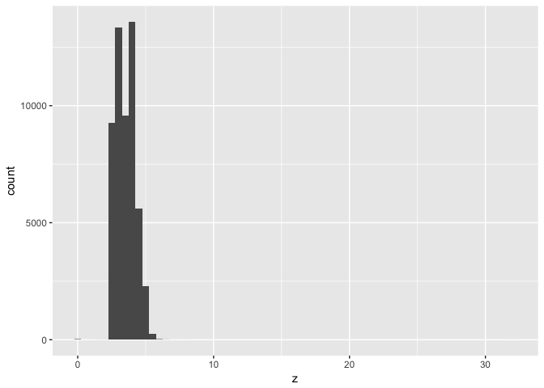

# Homework 5


##Load the libraries

```r
library(tidyverse)
library(ggstance)
diamonds<-diamonds
```

## 7.3.4 Exercises

1. Explore the distribution of each of the x, y, and z variables in diamonds. What do you learn? Think about a diamond and how you might decide which dimension is the length, width, and depth.


```r
?diamonds

ggplot(data = diamonds) +
  geom_histogram(mapping = aes(x = x), binwidth = 0.5)
```

<!-- -->

```r
ggplot(data = diamonds) +
  geom_histogram(mapping = aes(x = y), binwidth = 0.5)
```

<!-- -->

```r
ggplot(data = diamonds) +
  geom_histogram(mapping = aes(x = z), binwidth = 0.5)
```

<!-- -->


```r
diamonds %>%
  count(cut_width(x, 0.5))
```

```
## # A tibble: 16 × 2
##    `cut_width(x, 0.5)`     n
##                 <fctr> <int>
## 1         [-0.25,0.25]     8
## 2          (3.25,3.75]     3
## 3          (3.75,4.25]  1834
## 4          (4.25,4.75] 12680
## 5          (4.75,5.25]  7502
## 6          (5.25,5.75]  6448
## 7          (5.75,6.25]  6031
## 8          (6.25,6.75]  9381
## 9          (6.75,7.25]  4193
## 10         (7.25,7.75]  3437
## 11         (7.75,8.25]  1620
## 12         (8.25,8.75]   699
## 13         (8.75,9.25]    79
## 14         (9.25,9.75]    18
## 15         (9.75,10.2]     6
## 16         (10.2,10.8]     1
```

```r
diamonds %>% 
  count(cut_width(y, 0.5))
```

```
## # A tibble: 18 × 2
##    `cut_width(y, 0.5)`     n
##                 <fctr> <int>
## 1         [-0.25,0.25]     7
## 2          (3.25,3.75]     6
## 3          (3.75,4.25]  1730
## 4          (4.25,4.75] 12566
## 5          (4.75,5.25]  7556
## 6          (5.25,5.75]  6272
## 7          (5.75,6.25]  6464
## 8          (6.25,6.75]  9382
## 9          (6.75,7.25]  4176
## 10         (7.25,7.75]  3425
## 11         (7.75,8.25]  1612
## 12         (8.25,8.75]   654
## 13         (8.75,9.25]    67
## 14         (9.25,9.75]    14
## 15         (9.75,10.2]     6
## 16         (10.2,10.8]     1
## 17         (31.8,32.2]     1
## 18         (58.8,59.2]     1
```

```r
diamonds %>% 
  count(cut_width(z, 0.5))
```

```
## # A tibble: 16 × 2
##    `cut_width(z, 0.5)`     n
##                 <fctr> <int>
## 1         [-0.25,0.25]    20
## 2          (0.75,1.25]     1
## 3          (1.25,1.75]     2
## 4          (1.75,2.25]     3
## 5          (2.25,2.75]  9276
## 6          (2.75,3.25] 13340
## 7          (3.25,3.75]  9572
## 8          (3.75,4.25] 13584
## 9          (4.25,4.75]  5589
## 10         (4.75,5.25]  2288
## 11         (5.25,5.75]   238
## 12         (5.75,6.25]    19
## 13         (6.25,6.75]     5
## 14         (6.75,7.25]     1
## 15         (7.75,8.25]     1
## 16         (31.8,32.2]     1
```


```r
diamonds%>%
  filter(cut=="Premium")%>%
ggplot(mapping = aes(x = carat, colour = cut)) +
  geom_freqpoly(binwidth = 0.1)
```

<!-- -->

```r
diamonds%>%
  filter(cut=="Premium")%>%
ggplot() +
  geom_histogram(mapping = aes(x = x), binwidth = 0.5)
```

<!-- -->

```r
diamonds%>%
  filter(cut=="Premium")%>%
ggplot() +
  geom_histogram(mapping = aes(x = y), binwidth = 0.5)
```

<!-- -->

```r
diamonds%>%
  filter(cut=="Premium")%>%
ggplot() +
  geom_histogram(mapping = aes(x = z), binwidth = 0.5)
```

<!-- -->

```r
ggplot(data=diamonds)+
  geom_histogram(mapping=aes(x=x, fill=cut), binwidth = 0.8, position="dodge")
```

<!-- -->

2. Explore the distribution of price. Do you discover anything unusual or surprising? (Hint: Carefully think about the binwidth and make sure you try a wide range of values.)


```r
ggplot(data=diamonds)+
  geom_histogram(mapping = aes(x=price), binwidth=25)
```

<!-- -->

```r
ggplot(data=diamonds)+
  geom_histogram(mapping = aes(x=price), binwidth=25)+
  coord_cartesian(xlim=c(0,2500))
```

<!-- -->

```r
diamonds%>%
filter(price<2000)%>%
ggplot()+
  geom_histogram(mapping = aes(x = price), binwidth = 5)
```

<!-- -->

3. How many diamonds are 0.99 carat? How many are 1 carat? What do you think is the cause of the difference?


```r
diamonds %>%
  filter(carat >= 0.99, carat <= 1) %>%
  count(carat)
```

```
## # A tibble: 2 × 2
##   carat     n
##   <dbl> <int>
## 1  0.99    23
## 2  1.00  1558
```

4. Compare and contrast coord_cartesian() vs xlim() or ylim() when zooming in on a histogram. What happens if you leave binwidth unset? What happens if you try and zoom so only half a bar shows?


```r
ggplot(data=diamonds) + 
  geom_histogram(mapping = aes(x = price), binwidth = 10) +
  coord_cartesian(xlim = c(500, 1000))
```

<!-- -->

```r
ggplot(data=diamonds) + 
  geom_histogram(mapping = aes(x = price), binwidth = 10)
```

<!-- -->

```r
ggplot(data=diamonds) + 
  geom_histogram(mapping = aes(x = price), binwidth = 20) +
  coord_cartesian(xlim = c(15000, 18000), ylim = c(0, 25))
```

<!-- -->

```r
ggplot(data=diamonds) + 
  geom_histogram(mapping = aes(x = price), binwidth = 20)
```

<!-- -->

##7.4.1 Exercises

1. What happens to missing values in a histogram? What happens to missing values in a bar chart? Why is there a difference?

geom_bar will plot the values separately, geom_hist removes the values and tells you.


```r
diamonds2 <- diamonds %>% 
  mutate(y = ifelse(y < 3 | y > 20, NA, y))

ggplot(data=diamonds)+
  geom_bar(mapping=aes(x=cut, fill=price))
```

<!-- -->

2. What does na.rm = TRUE do in mean() and sum()?

removes the missing values prior to calculation.

##7.5.1.1 Exercises

1. Use what you’ve learned to improve the visualisation of the departure times of cancelled vs. non-cancelled flights.


2. What variable in the diamonds dataset is most important for predicting the price of a diamond? How is that variable correlated with cut? Why does the combination of those two relationships lead to lower quality diamonds being more expensive?

3. Install the ggstance package, and create a horizontal boxplot. How does this compare to using coord_flip()?


```r
ggplot(data = diamonds) +
  geom_boxplot(mapping = aes(x = cut, y = price)) +
  coord_flip()
```

<!-- -->

  
4. One problem with boxplots is that they were developed in an era of much smaller datasets and tend to display a prohibitively large number of “outlying values”. One approach to remedy this problem is the letter value plot. Install the lvplot package, and try using geom_lv() to display the distribution of price vs cut. What do you learn? How do you interpret the plots?

5. Compare and contrast geom_violin() with a facetted geom_histogram(), or a coloured geom_freqpoly(). What are the pros and cons of each method?

6. If you have a small dataset, it’s sometimes useful to use geom_jitter() to see the relationship between a continuous and categorical variable. The ggbeeswarm package provides a number of methods similar to geom_jitter(). List them and briefly describe what each one does.

##7.5.2.1 Exercises

1. How could you rescale the count dataset above to more clearly show the distribution of cut within colour, or colour within cut?

2. Use geom_tile() together with dplyr to explore how average flight delays vary by destination and month of year. What makes the plot difficult to read? How could you improve it?

3. Why is it slightly better to use aes(x = color, y = cut) rather than aes(x = cut, y = color) in the example above?

##7.5.3.1 Exercises

1. Instead of summarising the conditional distribution with a boxplot, you could use a frequency polygon. What do you need to consider when using cut_width() vs cut_number()? How does that impact a visualisation of the 2d distribution of carat and price?

2. Visualise the distribution of carat, partitioned by price.

3. How does the price distribution of very large diamonds compare to small diamonds. Is it as you expect, or does it surprise you?

4. Combine two of the techniques you’ve learned to visualise the combined distribution of cut, carat, and price.

5. Two dimensional plots reveal outliers that are not visible in one dimensional plots. For example, some points in the plot below have an unusual combination of x and y values, which makes the points outliers even though their x and y values appear normal when examined separately.
