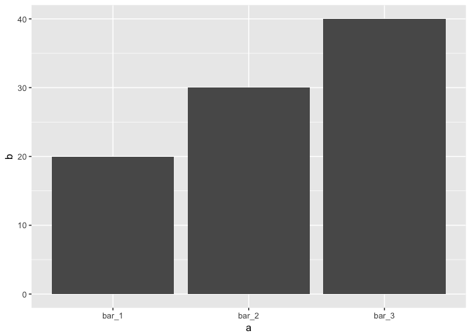
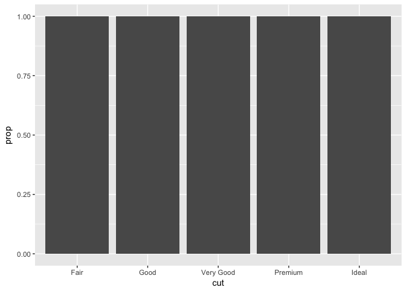
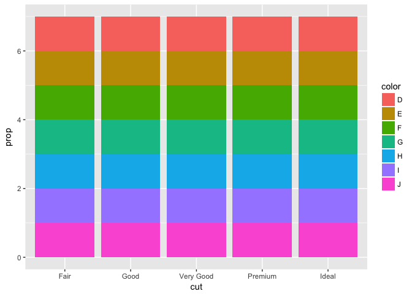
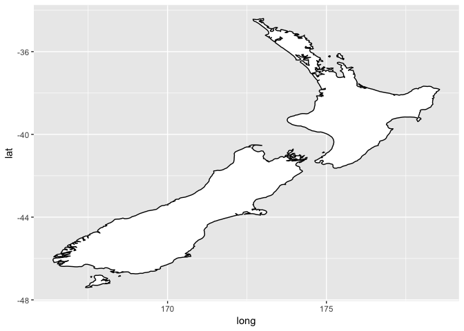

# ggplot (con’t)


##Load the libraries

```r
library(tidyverse)
```

```
## Loading tidyverse: ggplot2
## Loading tidyverse: tibble
## Loading tidyverse: tidyr
## Loading tidyverse: readr
## Loading tidyverse: purrr
## Loading tidyverse: dplyr
```

```
## Conflicts with tidy packages ----------------------------------------------
```

```
## filter(): dplyr, stats
## lag():    dplyr, stats
```

```r
library(maps)
```

```
## 
## Attaching package: 'maps'
```

```
## The following object is masked from 'package:purrr':
## 
##     map
```

##3.6 Geometric Objects


```r
# scatterplot
ggplot(data = mpg) + 
  geom_point(mapping = aes(x = displ, y = hwy))
```

<!-- -->

```r
# fitted line
ggplot(data = mpg) + 
  geom_smooth(mapping = aes(x = displ, y = hwy))
```

```
## `geom_smooth()` using method = 'loess'
```

<!-- -->


```r
ggplot(data = mpg) + 
  geom_smooth(mapping = aes(x = displ, y = hwy, linetype = drv))
```

```
## `geom_smooth()` using method = 'loess'
```

<!-- -->

```r
ggplot(data = mpg) + 
  geom_point(mapping = aes(x = displ, y = hwy, color = drv)) +
  geom_smooth(mapping = aes(x = displ, y = hwy, linetype = drv))
```

```
## `geom_smooth()` using method = 'loess'
```

<!-- -->


```r
ggplot(data = mpg) +
  geom_smooth(mapping = aes(x = displ, y = hwy))
```

```
## `geom_smooth()` using method = 'loess'
```

<!-- -->

```r
ggplot(data = mpg) +
  geom_smooth(mapping = aes(x = displ, y = hwy, group = drv))
```

```
## `geom_smooth()` using method = 'loess'
```

<!-- -->

```r
ggplot(data = mpg) +
  geom_smooth(mapping = aes(x = displ, y = hwy, group = drv))
```

```
## `geom_smooth()` using method = 'loess'
```

<!-- -->


```r
ggplot(data = mpg) + 
  geom_point(mapping = aes(x = displ, y = hwy)) +
  geom_smooth(mapping = aes(x = displ, y = hwy))
```

```
## `geom_smooth()` using method = 'loess'
```

<!-- -->

This is pretty helpful.

```r
ggplot(data = mpg, mapping = aes(x = displ, y = hwy)) + 
  geom_point() + 
  geom_smooth()
```

```
## `geom_smooth()` using method = 'loess'
```

<!-- -->

Thinking about geom's in layers.

```r
ggplot(data = mpg, mapping = aes(x = displ, y = hwy)) + 
  geom_point(mapping = aes(color = class)) + 
  geom_smooth()
```

```
## `geom_smooth()` using method = 'loess'
```

<!-- -->

Filter is a dplyr command.

```r
ggplot(data = mpg, mapping = aes(x = displ, y = hwy)) + 
  geom_point(mapping = aes(color = class)) + 
  geom_smooth(data = filter(mpg, class == "subcompact"), se = FALSE)
```

```
## `geom_smooth()` using method = 'loess'
```

<!-- -->

1. What geom would you use to draw a line chart? A boxplot? A histogram? An area chart?
line; depends on the data? geom_abline()
boxplot; geom_boxplot()
area; geom_area()

2. Run this code in your head and predict what the output will look like. Then, run the code in R and check your predictions.


```r
ggplot(data = mpg, mapping = aes(x = displ, y = hwy, color = drv)) + 
  geom_point() + 
  geom_smooth(se = FALSE)
```

```
## `geom_smooth()` using method = 'loess'
```

<!-- -->

3. What does show.legend = FALSE do? What happens if you remove it?


```r
ggplot(data = mpg, mapping = aes(x = displ, y = hwy, color = drv, show.legend = FALSE)) + 
  geom_point() + 
  geom_smooth()
```

```
## `geom_smooth()` using method = 'loess'
```

<!-- -->

4. What does the se argument to geom_smooth() do?
Confidence intervals go away? There is too much overlap.

```r
ggplot(data = mpg, mapping = aes(x = displ, y = hwy, color = drv)) + 
  geom_point() + 
  geom_smooth()
```

```
## `geom_smooth()` using method = 'loess'
```

<!-- -->

5. Will these two graphs look different? Why/why not?
No, the first one universally defines the variables.

```r
ggplot(data = mpg, mapping = aes(x = displ, y = hwy)) + 
  geom_point() + 
  geom_smooth()
```

```
## `geom_smooth()` using method = 'loess'
```

<!-- -->

```r
ggplot() + 
  geom_point(data = mpg, mapping = aes(x = displ, y = hwy)) + 
  geom_smooth(data = mpg, mapping = aes(x = displ, y = hwy))
```

```
## `geom_smooth()` using method = 'loess'
```

<!-- -->

6. Recreate the R code necessary to generate the following graphs.

Plot 1

```r
ggplot(data = mpg, mapping = aes(x = displ, y = hwy)) + 
  geom_point() + 
  geom_smooth(se = FALSE)
```

```
## `geom_smooth()` using method = 'loess'
```

<!-- -->

Plot 2

```r
ggplot(data = mpg, mapping = aes(x = displ, y = hwy, group = drv)) + 
  geom_point() + 
  geom_smooth(se = FALSE)
```

```
## `geom_smooth()` using method = 'loess'
```

<!-- -->

Plot 3

```r
ggplot(data = mpg, mapping = aes(x = displ, y = hwy, group = drv, color = drv)) + 
  geom_point() + 
  geom_smooth(se = FALSE)
```

```
## `geom_smooth()` using method = 'loess'
```

<!-- -->

Plot 4

```r
ggplot(data = mpg) + 
  geom_point(mapping = aes(x = displ, y = hwy, color = drv)) +
  geom_smooth(mapping = aes(x = displ, y = hwy))
```

```
## `geom_smooth()` using method = 'loess'
```

<!-- -->

Plot 5

```r
ggplot(data = mpg) + 
  geom_point(mapping = aes(x = displ, y = hwy, color = drv)) +
  geom_smooth(mapping = aes(x = displ, y = hwy, color = drv, linetype = drv))
```

```
## `geom_smooth()` using method = 'loess'
```

<!-- -->

Plot 6

```r
ggplot(data = mpg) + 
  geom_point(mapping = aes(x = displ, y = hwy, color = drv))
```

<!-- -->

##3.7 Statistical Transformations


```r
ggplot(data = diamonds) + 
  geom_bar(mapping = aes(x = cut))
```

<!-- -->

Same plot, specifying stat_count

```r
ggplot(data = diamonds) + 
  stat_count(mapping = aes(x = cut))
```

<!-- -->


```r
demo <- tribble(
  ~a,      ~b,
  "bar_1", 20,
  "bar_2", 30,
  "bar_3", 40
)

ggplot(data = demo) +
  geom_bar(mapping = aes(x = a, y = b), stat = "identity")
```

<!-- -->


```r
ggplot(data = diamonds) + 
  geom_bar(mapping = aes(x = cut, y = ..prop.., group = 1))
```

<!-- -->


```r
?stat_summary
ggplot(data = diamonds) + 
  stat_summary(
    mapping = aes(x = cut, y = depth),
    fun.ymin = min,
    fun.ymax = max,
    fun.y = median
  )
```

<!-- -->

1. What is the default geom associated with stat_summary()? How could you rewrite the previous plot to use that geom function instead of the stat function?

geom_pointrange


```r
?diamonds
?stat_bin
?geom_pointrange
ggplot(data = diamonds) + 
  geom_pointrange(mapping = aes(x = cut, y = depth), stat = "summary", 
  fun.ymin = min,
  fun.ymax = max,
  fun.y = median)
```

<!-- -->

2. What does geom_col() do? How is it different to geom_bar()?

geom_bar uses the count transformation.
geom_col uses identity transformation.


```r
?stat_identity
diamonds
```

```
## # A tibble: 53,940 × 10
##    carat       cut color clarity depth table price     x     y     z
##    <dbl>     <ord> <ord>   <ord> <dbl> <dbl> <int> <dbl> <dbl> <dbl>
## 1   0.23     Ideal     E     SI2  61.5    55   326  3.95  3.98  2.43
## 2   0.21   Premium     E     SI1  59.8    61   326  3.89  3.84  2.31
## 3   0.23      Good     E     VS1  56.9    65   327  4.05  4.07  2.31
## 4   0.29   Premium     I     VS2  62.4    58   334  4.20  4.23  2.63
## 5   0.31      Good     J     SI2  63.3    58   335  4.34  4.35  2.75
## 6   0.24 Very Good     J    VVS2  62.8    57   336  3.94  3.96  2.48
## 7   0.24 Very Good     I    VVS1  62.3    57   336  3.95  3.98  2.47
## 8   0.26 Very Good     H     SI1  61.9    55   337  4.07  4.11  2.53
## 9   0.22      Fair     E     VS2  65.1    61   337  3.87  3.78  2.49
## 10  0.23 Very Good     H     VS1  59.4    61   338  4.00  4.05  2.39
## # ... with 53,930 more rows
```

```r
ggplot(data = diamonds) + 
  geom_col(mapping = aes(x = cut, y = price))
```

<!-- -->

```r
ggplot(data = diamonds) + 
  geom_bar(mapping = aes(x = cut))
```

<!-- -->

```r
ggplot(data = diamonds) + 
  geom_bar(mapping = aes(x = price))
```

<!-- -->
```

3. Most geoms and stats come in pairs that are almost always used in concert. Read through the documentation and make a list of all the pairs. What do they have in common?


4. What variables does stat_smooth() compute? What parameters control its behaviour?

same as geom_smooth


```r
?stat_smooth
```

5. In our proportion bar chart, we need to set group = 1. Why? In other words what is the problem with these two graphs?

All of the bars are of the same height. 

```r
ggplot(data = diamonds) + 
  geom_bar(mapping = aes(x = cut, y = ..prop..))
```

<!-- -->

```r
ggplot(data = diamonds) + 
  geom_bar(mapping = aes(x = cut, fill = color, y = ..prop..))
```

<!-- -->

```r
ggplot(data = diamonds) + 
  geom_bar(mapping = aes(x = cut, y = ..prop.., group = 1))
```

<!-- -->

```r
ggplot(data = diamonds) + 
  geom_bar(mapping = aes(x = cut, fill = color, y = ..prop.., group = color))
```

<!-- -->

##3.8 Position Adjustments


```r
ggplot(data = diamonds) + 
  geom_bar(mapping = aes(x = cut, colour = cut))
```

<!-- -->

```r
ggplot(data = diamonds) + 
  geom_bar(mapping = aes(x = cut, fill = cut))
```

<!-- -->
 

```r
  ggplot(data = diamonds) + 
  geom_bar(mapping = aes(x = cut, fill = clarity))
```

<!-- -->

Identity

```r
ggplot(data = diamonds, mapping = aes(x = cut, fill = clarity)) + 
  geom_bar(alpha = 1/5, position = "identity")
```

<!-- -->

```r
ggplot(data = diamonds, mapping = aes(x = cut, colour = clarity)) + 
  geom_bar(fill = NA, position = "identity")
```

<!-- -->

Fill

```r
ggplot(data = diamonds) + 
  geom_bar(mapping = aes(x = cut, fill = clarity), position = "fill")
```

<!-- -->

Dodge

```r
ggplot(data = diamonds) + 
  geom_bar(mapping = aes(x = cut, fill = clarity), position = "dodge")
```

<!-- -->

Jitter to avoid overplotting

```r
ggplot(data = mpg) + 
  geom_point(mapping = aes(x = displ, y = hwy), position = "jitter")
```

<!-- -->

1. What is the problem with this plot? How could you improve it?
Overplotting, use jitter.


```r
ggplot(data = mpg, mapping = aes(x = cty, y = hwy)) + 
  geom_point()
```

<!-- -->

```r
 ggplot(data = mpg, mapping = aes(x = cty, y = hwy)) + 
  geom_jitter() 
```

<!-- -->

2. What parameters to geom_jitter() control the amount of jittering?

height and width


```r
ggplot(data = mpg, mapping = aes(x = cty, y = hwy)) + 
  geom_point(position = position_jitter(width = 1, height = 2))
```

<!-- -->

3. Compare and contrast geom_jitter() with geom_count().


```r
ggplot(data = mpg, mapping = aes(x = cty, y = hwy)) + 
  geom_jitter()
```

<!-- -->

```r
 ggplot(data = mpg, mapping = aes(x = cty, y = hwy)) + 
  geom_count() 
```

<!-- -->

4. What’s the default position adjustment for geom_boxplot()? Create a visualisation of the mpg dataset that demonstrates it.

Dodge


```r
mpg
```

```
## # A tibble: 234 × 11
##    manufacturer      model displ  year   cyl      trans   drv   cty   hwy
##           <chr>      <chr> <dbl> <int> <int>      <chr> <chr> <int> <int>
## 1          audi         a4   1.8  1999     4   auto(l5)     f    18    29
## 2          audi         a4   1.8  1999     4 manual(m5)     f    21    29
## 3          audi         a4   2.0  2008     4 manual(m6)     f    20    31
## 4          audi         a4   2.0  2008     4   auto(av)     f    21    30
## 5          audi         a4   2.8  1999     6   auto(l5)     f    16    26
## 6          audi         a4   2.8  1999     6 manual(m5)     f    18    26
## 7          audi         a4   3.1  2008     6   auto(av)     f    18    27
## 8          audi a4 quattro   1.8  1999     4 manual(m5)     4    18    26
## 9          audi a4 quattro   1.8  1999     4   auto(l5)     4    16    25
## 10         audi a4 quattro   2.0  2008     4 manual(m6)     4    20    28
## # ... with 224 more rows, and 2 more variables: fl <chr>, class <chr>
```

```r
ggplot(data = mpg, aes(x = class, y = hwy, fill = trans)) +
  geom_boxplot()
```

<!-- -->

##3.9 Coordinate Systems


```r
ggplot(data = mpg, mapping = aes(x = class, y = hwy)) + 
  geom_boxplot()
```

<!-- -->

```r
ggplot(data = mpg, mapping = aes(x = class, y = hwy)) + 
  geom_boxplot() +
  coord_flip()
```

<!-- -->


```r
nz <- map_data("nz")

ggplot(nz, aes(long, lat, group = group)) +
  geom_polygon(fill = "white", colour = "black")
```

<!-- -->

```r
ggplot(nz, aes(long, lat, group = group)) +
  geom_polygon(fill = "white", colour = "black") +
  coord_quickmap()
```

<!-- -->


```r
bar <- ggplot(data = diamonds) + 
  geom_bar(
    mapping = aes(x = cut, fill = cut), 
    show.legend = FALSE,
    width = 1
  ) + 
  theme(aspect.ratio = 1) +
  labs(x = NULL, y = NULL)

bar + coord_flip()
```

<!-- -->

```r
bar + coord_polar()
```

<!-- -->

1. Turn a stacked bar chart into a pie chart using coord_polar().


```r
diamonds
```

```
## # A tibble: 53,940 × 10
##    carat       cut color clarity depth table price     x     y     z
##    <dbl>     <ord> <ord>   <ord> <dbl> <dbl> <int> <dbl> <dbl> <dbl>
## 1   0.23     Ideal     E     SI2  61.5    55   326  3.95  3.98  2.43
## 2   0.21   Premium     E     SI1  59.8    61   326  3.89  3.84  2.31
## 3   0.23      Good     E     VS1  56.9    65   327  4.05  4.07  2.31
## 4   0.29   Premium     I     VS2  62.4    58   334  4.20  4.23  2.63
## 5   0.31      Good     J     SI2  63.3    58   335  4.34  4.35  2.75
## 6   0.24 Very Good     J    VVS2  62.8    57   336  3.94  3.96  2.48
## 7   0.24 Very Good     I    VVS1  62.3    57   336  3.95  3.98  2.47
## 8   0.26 Very Good     H     SI1  61.9    55   337  4.07  4.11  2.53
## 9   0.22      Fair     E     VS2  65.1    61   337  3.87  3.78  2.49
## 10  0.23 Very Good     H     VS1  59.4    61   338  4.00  4.05  2.39
## # ... with 53,930 more rows
```

```r
ggplot(diamonds, aes(x = cut, fill = color)) +
  geom_bar()
```

<!-- -->

```r
ggplot(diamonds, aes(x = cut, fill = color)) +
  geom_bar(width = 1) +
  coord_polar(theta = "y")
```

<!-- -->

2. What does labs() do? Read the documentation.

Adds labels.

3. What’s the difference between coord_quickmap() and coord_map()?

Can't get the map to load.

4. What does the plot below tell you about the relationship between city and highway mpg? Why is coord_fixed() important? What does geom_abline() do?


```r
ggplot(data = mpg, mapping = aes(x = cty, y = hwy)) +
  geom_point() + 
  geom_abline() +
  coord_fixed()
```

<!-- -->

```r
ggplot(data = mpg, mapping = aes(x = cty, y = hwy)) +
  geom_point() + 
  geom_abline()
```

<!-- -->
